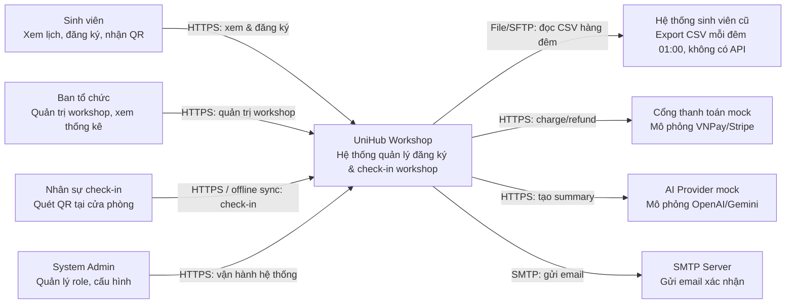
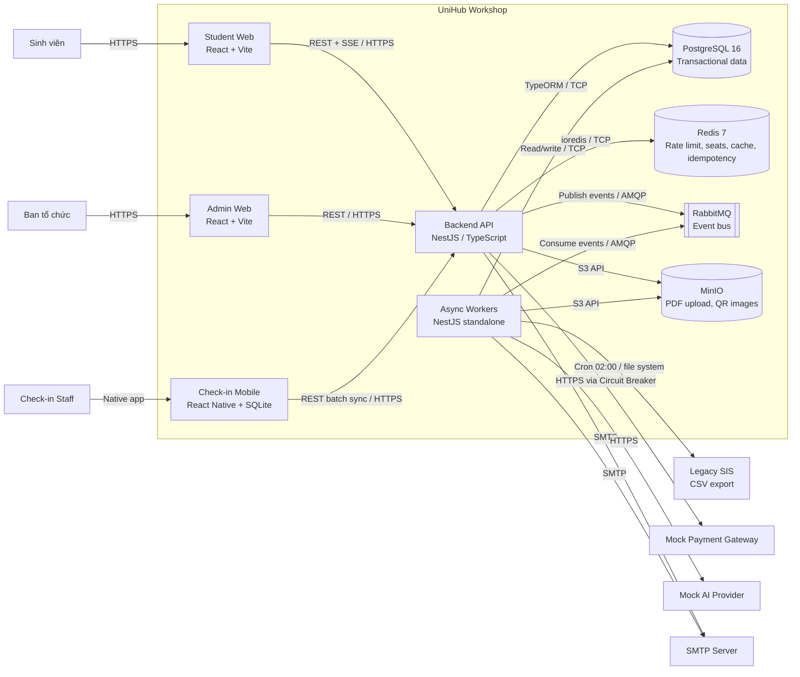
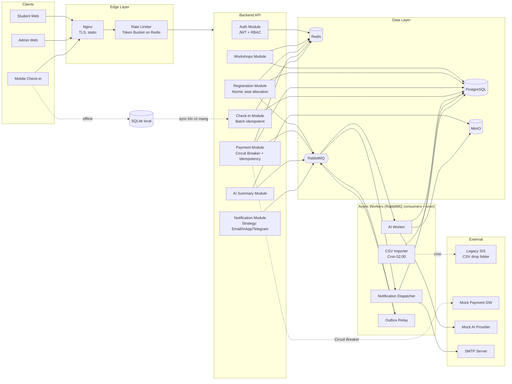
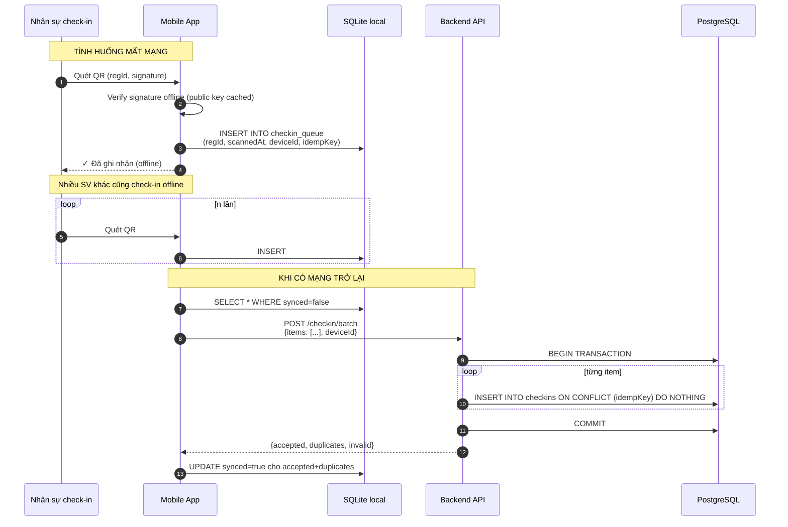
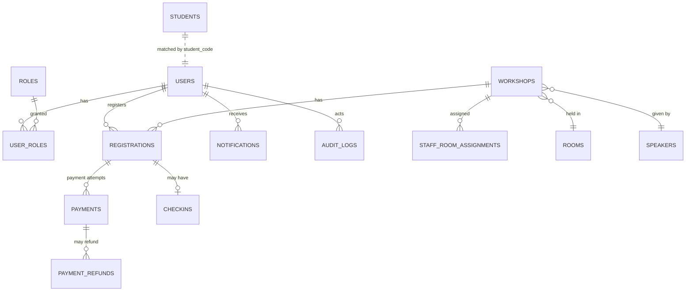
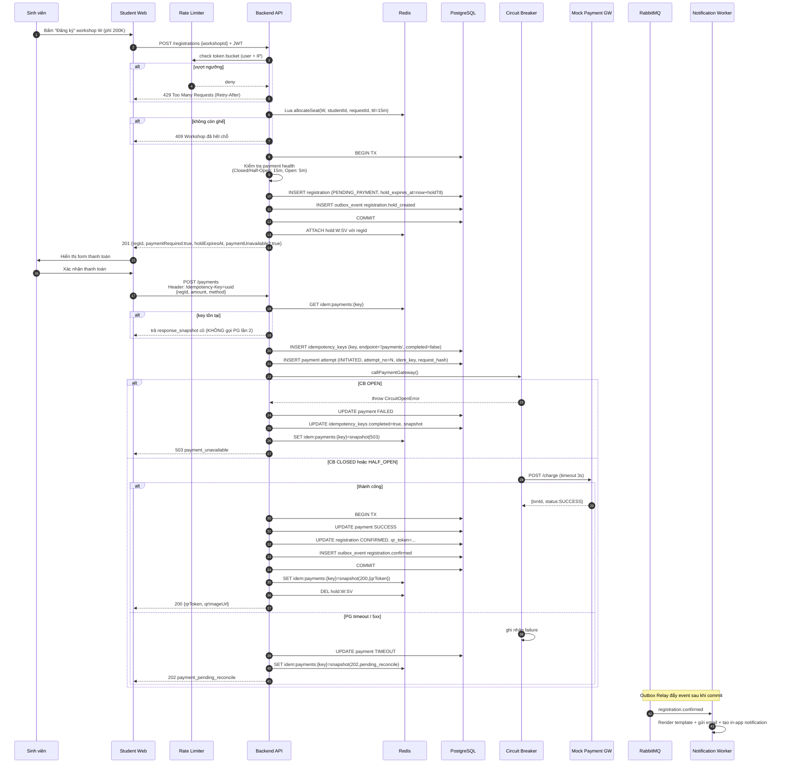
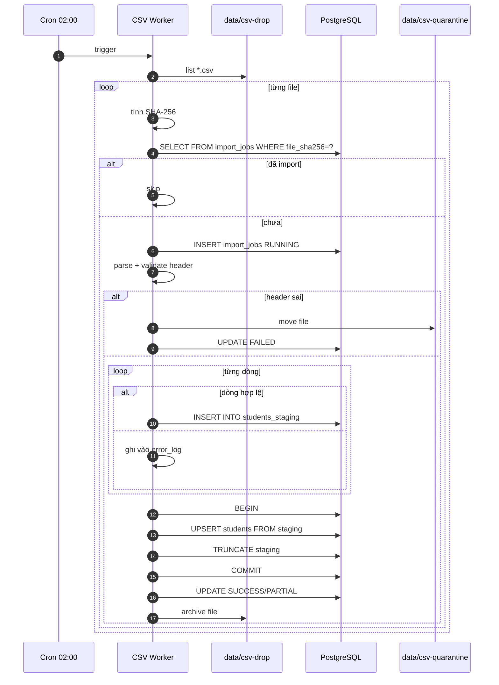
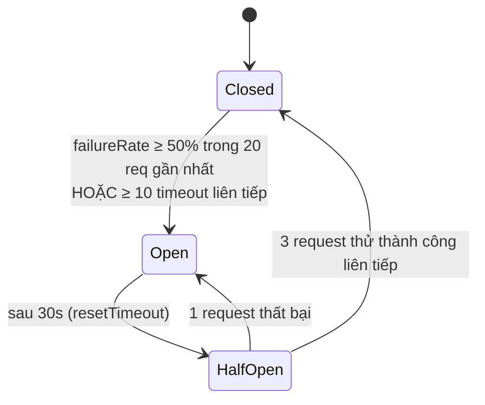
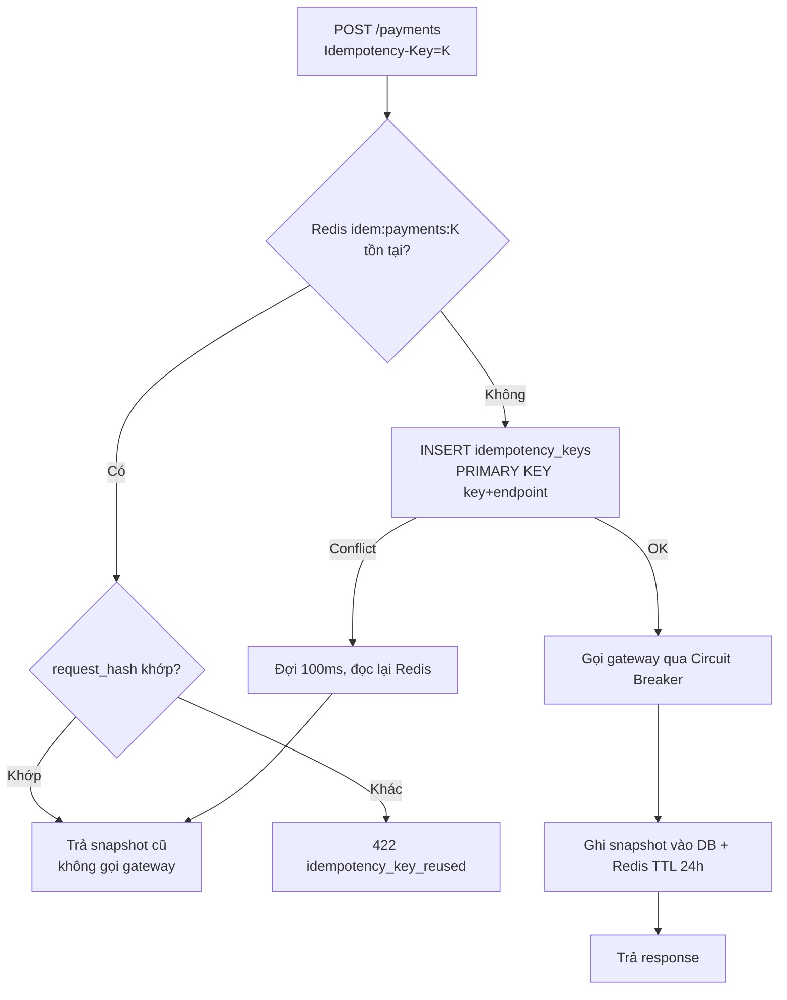

# UniHub Workshop — Technical Design

> Phần 1 / Blueprint • Tài liệu thiết kế kỹ thuật • Phiên bản 1.0

## 1. Kiến trúc tổng thể

### 1.1 Architectural Style được chọn

Hệ thống được thiết kế theo **Modular Monolith** ở backend, kết hợp với **một số worker bất đồng bộ tách riêng** cho các tác vụ nặng (AI Summary, CSV Import, Notification dispatch). Frontend tách thành 3 ứng dụng độc lập (Student Web, Admin Web, Check-in Mobile).

**Lý do chọn Modular Monolith** (so với Microservices):

- Quy mô đồ án + thời gian giới hạn → microservices gây overhead vận hành (service discovery, distributed tracing, eventual consistency).
- Số lượng team (3 người) nhỏ → một codebase duy nhất giúp đồng bộ thay đổi dễ hơn.
- Có thể đạt tất cả mục tiêu hiệu năng (12K SV / 10 phút) nhờ Redis + connection pooling, không cần phân tách dịch vụ vật lý.
- Thiết kế **modular** (mỗi domain là 1 NestJS module riêng, không gọi chéo qua repository) → dễ bóc tách thành microservices ở học kỳ sau nếu cần.

**Lý do tách worker async ra process riêng**:

- AI Summary có thể mất 5–30 giây / file → không thể chiếm worker HTTP.
- CSV Import chạy lúc 02:00 đêm, 10K dòng → cần process scheduler riêng.
- Notification dispatch cần retry, không nên block luồng request đăng ký.

### 1.2 Các thành phần chính

| Thành phần                | Vai trò                                                                              | Công nghệ                                  |
| ------------------------- | ------------------------------------------------------------------------------------ | ------------------------------------------ |
| **Student Web**           | UI cho sinh viên xem & đăng ký workshop, xem QR                                      | React 18 + Vite + TailwindCSS + shadcn/ui  |
| **Admin Web**             | UI cho ban tổ chức quản lý workshop, upload PDF, xem thống kê                        | React 18 + Vite + shadcn/ui + Recharts     |
| **Check-in Mobile**       | App quét QR, hỗ trợ offline                                                          | React Native (Expo) + SQLite (expo-sqlite) |
| **API Gateway / Backend** | REST API, auth, rate limit, circuit breaker, business logic                          | NestJS (Node.js / TypeScript)              |
| **Async Workers**         | AI Summary worker, CSV importer (cron), notification dispatcher, outbox relay        | NestJS standalone app + RabbitMQ consumers |
| **Mock Payment Gateway**  | Service mô phỏng cổng thanh toán có thể bật/tắt lỗi                                  | NestJS standalone (port riêng)             |
| **PostgreSQL**            | DB chính (transactional data)                                                        | PostgreSQL 16                              |
| **Redis**                 | Cache, rate limit counter, seat counter atomic, idempotency store, session blacklist | Redis 7                                    |
| **RabbitMQ**              | Message broker cho event (registration confirmed, payment completed, ...)            | RabbitMQ 3                                 |
| **MinIO**                 | Object storage cho file PDF upload                                                   | MinIO (tương thích S3)                     |
| **Mock AI Provider**      | Service mô phỏng OpenAI/Gemini                                                       | NestJS standalone                          |

### 1.3 Cách các thành phần giao tiếp

- **Client ↔ Backend**: HTTPS REST + JWT bearer token. Sự kiện real-time (số chỗ còn lại) qua **Server-Sent Events (SSE)** thay vì WebSocket để đơn giản và đủ dùng.
- **Backend ↔ DB**: TCP connection pool (TypeORM, pool size 30/instance).
- **Backend ↔ Redis**: TCP, ioredis client, pipeline cho atomic ops.
- **Backend ↔ Workers**: RabbitMQ (durable queue, ack manual). Event payload định nghĩa trong `contracts/events.ts`.
- **Backend ↔ Payment Gateway**: HTTPS, bọc qua **Circuit Breaker** + **timeout 3s** + **retry exponential backoff (max 2)**.
- **Mobile Check-in ↔ Backend**: REST. Khi offline, app ghi vào SQLite local; khi có mạng, gọi `POST /checkin/batch` (idempotent).

### 1.4 Hành vi khi từng thành phần gặp sự cố

| Thành phần down          | Tác động                                           | Hành vi hệ thống                                                                                   |
| ------------------------ | -------------------------------------------------- | -------------------------------------------------------------------------------------------------- |
| **PostgreSQL**           | Toàn bộ ghi/đọc cốt lõi dừng                       | Backend trả 503; trang catalog vẫn phục vụ từ Redis cache (TTL 5 phút)                             |
| **Redis**                | Mất rate limit + atomic seat counter + idempotency | Fallback: rate limit chuyển sang in-memory; seat allocation về full DB lock; idempotency key đi DB |
| **RabbitMQ**             | Event không phát đi                                | Notification & AI Summary delay; backend ghi outbox table → retry khi MQ phục hồi                  |
| **Mock Payment Gateway** | Không thanh toán được                              | **Circuit Breaker mở**, **Graceful Degradation**: catalog/đăng ký free/check-in/AI/CSV vẫn chạy    |
| **Mock AI Provider**     | Summary không tạo được                             | Worker retry với backoff; trang chi tiết hiển thị "Đang tạo tóm tắt"                               |
| **Mobile mất mạng**      | Không gọi được API                                 | Lưu local SQLite, sync khi có mạng                                                                 |

---

## 2. C4 Diagram

### 2.1 Level 1 — System Context


> Rendered PNG with white background. Local fallback: `blueprint/assets/diagrams-png/c4-level-1-system-context.png`. Mermaid source below is kept for editing.
> Mermaid bên dưới là nguồn tương thích rộng để chỉnh sửa nhanh khi cần.



### 2.2 Level 2 — Container


> Rendered PNG with white background. Local fallback: `blueprint/assets/diagrams-png/c4-level-2-container.png`. Mermaid source below is kept for editing.
> Mermaid bên dưới là nguồn tương thích rộng để chỉnh sửa nhanh khi cần.



---

## 3. High-Level Architecture Diagram


> Rendered PNG with white background. Local fallback: `assets/diagrams-png/design-03-3-high-level-architecture-diagram.png`. Mermaid source below is kept for editing.



### 3.1 Điểm tích hợp đặc biệt

**Tích hợp Legacy SIS (1 chiều)**

- CSV được drop vào thư mục `data/csv-drop/` lúc 01:00 (giả lập bằng cron của hệ thống cũ).
- Worker `CSVImporter` chạy lúc 02:00: scan folder → mỗi file đi qua pipeline `validate → staging → upsert idempotent → archive/quarantine`.
- Nếu file lỗi format toàn bộ → chuyển vào `data/csv-quarantine/` + log + gửi notification cho System Admin.
- Job CSV chạy ngoài luồng request, không gây downtime.

**Tích hợp Payment Gateway**

- Mọi request đi qua `PaymentClient` được bọc bởi **Circuit Breaker** (`opossum`).
- Trạng thái Circuit lưu in-memory per-instance; metrics push lên Prometheus mỗi 10s.
- Khi Circuit `Open` → backend trả `503` ngay không gọi gateway, kèm message thân thiện. Catalog/đăng ký free/check-in/AI/CSV vẫn chạy bình thường (Graceful Degradation).
- Webhook callback từ gateway đi vào endpoint `POST /payments/callback` (HMAC verify) → idempotent xử lý.

**Tích hợp AI Provider**

- Async hoàn toàn: admin upload PDF → backend lưu MinIO + tạo record `Workshop.summary_status = pending` → publish event `pdf.uploaded`.
- Worker AI: tải PDF → `pdf-parse` → clean → gọi AI API (timeout 30s, retry 3 lần) → ghi summary vào DB.
- Cache theo SHA-256 hash file (cùng file → cùng summary, không gọi lại AI).

### 3.2 Luồng Check-in Offline (chi tiết)


> Rendered PNG with white background. Local fallback: `assets/diagrams-png/design-04-3-2-luong-check-in-offline-chi-tiet.png`. Mermaid source below is kept for editing.



**Bảo đảm**:

- `idempKey = sha256(regId + deviceId + scannedAt_ms)` → cùng 1 lần quét gửi nhiều lần vẫn chỉ tạo 1 bản ghi.
- Mất kết nối giữa chừng batch → server đã commit phần trước, app retry phần sau (vì idempotent nên không lo trùng).
- Public key cache trong app để verify QR signature offline → chống QR giả mạo ngay tại thiết bị.

---

## 4. Thiết kế cơ sở dữ liệu

### 4.1 Lựa chọn loại database

Hệ thống dùng **kết hợp PostgreSQL (primary) + Redis (cache/atomic store) + MinIO (blob storage)**.

| Loại dữ liệu                                         | Đặc điểm                                                                                                            | Lựa chọn                                    | Lý do                                                                             |
| ---------------------------------------------------- | ------------------------------------------------------------------------------------------------------------------- | ------------------------------------------- | --------------------------------------------------------------------------------- |
| Users, Workshops, Registrations, Payments, Check-ins | Quan hệ chặt, transaction ACID, query phức tạp (JOIN, aggregate cho thống kê), constraint nghiêm ngặt (unique seat) | **PostgreSQL**                              | Tính nhất quán cao, transaction đa bảng, partial index, JSONB cho field linh hoạt |
| Seat counter (số chỗ còn lại real-time)              | Giảm/cộng atomic, tốc độ rất cao, không cần persistent dài                                                          | **Redis** (`DECR`/`INCR`)                   | Atomic ops single-threaded, tránh race; rebuild được từ PostgreSQL                |
| Rate limit counter                                   | Đếm theo cửa sổ thời gian, TTL ngắn (1–60 giây)                                                                     | **Redis**                                   | TTL native, sliding window dễ làm bằng `ZADD`/`ZREMRANGEBYSCORE`                  |
| Idempotency Key                                      | Lookup theo key, TTL 24h, cần durable fallback cho payment/registration/check-in                                    | **Redis + PostgreSQL**                      | Redis nhanh; bảng `idempotency_keys` chống trùng dài hạn và dùng khi Redis down   |
| Session blacklist (JWT revoke)                       | Lookup boolean, TTL = JWT exp                                                                                       | **Redis**                                   | Như trên                                                                          |
| Workshop catalog cache                               | Đọc nhiều, ghi ít, cần invalidate khi admin sửa                                                                     | **Redis** (read-through, TTL 5 phút)        | Giảm tải DB khi 12K SV cùng load catalog                                          |
| File PDF, QR images                                  | Blob, lớn, ít cập nhật                                                                                              | **MinIO (S3 API)**                          | DB không nên lưu blob; CDN-ready                                                  |
| Audit log, AI summary cache                          | Append-only, đọc theo thời gian                                                                                     | **PostgreSQL** (table partition theo tháng) | Phân tích sau này; partition tránh bảng quá lớn                                   |

### 4.2 Schema PostgreSQL — Các entity quan trọng

```sql
-- =========================
-- 1. Users & RBAC
-- =========================
CREATE TABLE users (
    id              UUID PRIMARY KEY DEFAULT gen_random_uuid(),
    email           VARCHAR(255) UNIQUE NOT NULL,
    password_hash   VARCHAR(255) NOT NULL,         -- bcrypt
    full_name       VARCHAR(255) NOT NULL,
    student_code    VARCHAR(20)  UNIQUE,           -- NULL nếu không phải SV
    phone           VARCHAR(20),
    is_active       BOOLEAN NOT NULL DEFAULT TRUE,
    created_at      TIMESTAMPTZ NOT NULL DEFAULT now(),
    updated_at      TIMESTAMPTZ NOT NULL DEFAULT now()
);

CREATE TABLE roles (
    id    SMALLSERIAL PRIMARY KEY,
    name  VARCHAR(50) UNIQUE NOT NULL  -- STUDENT, ORGANIZER, CHECKIN_STAFF, SYS_ADMIN
);

CREATE TABLE user_roles (
    user_id  UUID    REFERENCES users(id) ON DELETE CASCADE,
    role_id  SMALLINT REFERENCES roles(id) ON DELETE RESTRICT,
    PRIMARY KEY (user_id, role_id)
);

CREATE TABLE refresh_tokens (
    id           UUID PRIMARY KEY DEFAULT gen_random_uuid(),
    user_id      UUID NOT NULL REFERENCES users(id) ON DELETE CASCADE,
    token_hash   VARCHAR(128) UNIQUE NOT NULL,
    expires_at   TIMESTAMPTZ NOT NULL,
    revoked_at   TIMESTAMPTZ,
    created_at   TIMESTAMPTZ NOT NULL DEFAULT now()
);
CREATE INDEX idx_refresh_tokens_user ON refresh_tokens(user_id, expires_at DESC);

-- Sinh viên đồng bộ từ CSV (dữ liệu nguồn)
CREATE TABLE students (
    student_code   VARCHAR(20) PRIMARY KEY,
    full_name      VARCHAR(255) NOT NULL,
    email          VARCHAR(255),
    faculty        VARCHAR(100),
    cohort         VARCHAR(10),
    is_active      BOOLEAN NOT NULL DEFAULT TRUE,
    source_exported_at TIMESTAMPTZ,
    last_synced_at TIMESTAMPTZ NOT NULL DEFAULT now()
);

CREATE TABLE students_staging (
    import_job_id      UUID NOT NULL,
    line_no            INT NOT NULL,
    student_code       VARCHAR(20) NOT NULL,
    full_name          VARCHAR(255) NOT NULL,
    email              VARCHAR(255),
    faculty            VARCHAR(100),
    cohort             VARCHAR(10),
    is_active          BOOLEAN NOT NULL,
    source_exported_at TIMESTAMPTZ,
    PRIMARY KEY (import_job_id, line_no)
);

-- =========================
-- 2. Workshops
-- =========================
CREATE TABLE rooms (
    id        UUID PRIMARY KEY DEFAULT gen_random_uuid(),
    code      VARCHAR(20) UNIQUE NOT NULL,
    name      VARCHAR(255) NOT NULL,
    capacity  INT NOT NULL CHECK (capacity > 0),
    map_url   TEXT
);

CREATE TABLE speakers (
    id     UUID PRIMARY KEY DEFAULT gen_random_uuid(),
    name   VARCHAR(255) NOT NULL,
    title  VARCHAR(255),
    bio    TEXT,
    avatar_url TEXT
);

CREATE TYPE workshop_status AS ENUM ('DRAFT','PUBLISHED','CANCELLED','ENDED');
CREATE TYPE summary_status  AS ENUM ('NONE','PENDING','READY','FAILED');

CREATE TABLE workshops (
    id              UUID PRIMARY KEY DEFAULT gen_random_uuid(),
    title           VARCHAR(255) NOT NULL,
    description     TEXT,
    speaker_id      UUID REFERENCES speakers(id),
    room_id         UUID REFERENCES rooms(id),
    start_at        TIMESTAMPTZ NOT NULL,
    end_at          TIMESTAMPTZ NOT NULL,
    capacity        INT NOT NULL CHECK (capacity > 0),
    fee_amount      INT NOT NULL DEFAULT 0,         -- VND, 0 = miễn phí
    status          workshop_status NOT NULL DEFAULT 'DRAFT',
    pdf_object_key  TEXT,                            -- key trong MinIO
    pdf_sha256      VARCHAR(64),                     -- không UNIQUE; nhiều workshop có thể dùng cùng PDF
    summary         TEXT,
    summary_highlights JSONB,
    summary_status  summary_status NOT NULL DEFAULT 'NONE',
    created_by      UUID REFERENCES users(id),
    created_at      TIMESTAMPTZ NOT NULL DEFAULT now(),
    updated_at      TIMESTAMPTZ NOT NULL DEFAULT now(),
    version         INT NOT NULL DEFAULT 0,          -- optimistic lock
    CHECK (end_at > start_at)
);
CREATE INDEX idx_workshops_status_start ON workshops(status, start_at);
CREATE INDEX idx_workshops_room_time    ON workshops(room_id, start_at, end_at);

CREATE TABLE ai_summary_cache (
    pdf_sha256       VARCHAR(64) PRIMARY KEY,
    summary          TEXT NOT NULL,
    summary_highlights JSONB,
    model            VARCHAR(100),
    created_at       TIMESTAMPTZ NOT NULL DEFAULT now()
);

-- =========================
-- 3. Registrations
-- =========================
CREATE TYPE registration_status AS ENUM (
    'PENDING_PAYMENT', 'CONFIRMED', 'CANCELLED', 'EXPIRED'
);

CREATE TABLE registrations (
    id              UUID PRIMARY KEY DEFAULT gen_random_uuid(),
    workshop_id     UUID NOT NULL REFERENCES workshops(id),
    student_id      UUID NOT NULL REFERENCES users(id),
    status          registration_status NOT NULL,
    qr_token        VARCHAR(512) UNIQUE,            -- JWT-signed QR payload
    fee_amount      INT NOT NULL,
    hold_expires_at TIMESTAMPTZ,                    -- hạn giữ ghế chờ thanh toán
    created_at      TIMESTAMPTZ NOT NULL DEFAULT now(),
    confirmed_at    TIMESTAMPTZ,
    cancelled_at    TIMESTAMPTZ,
    UNIQUE (workshop_id, student_id)               -- 1 SV chỉ đăng ký 1 lần / workshop
);
CREATE INDEX idx_registrations_workshop_status ON registrations(workshop_id, status);
CREATE INDEX idx_registrations_student         ON registrations(student_id, created_at DESC);

-- =========================
-- 4. Payments
-- =========================
CREATE TYPE payment_status AS ENUM (
    'INITIATED', 'PENDING', 'SUCCESS', 'FAILED', 'TIMEOUT', 'REFUNDED'
);

CREATE TABLE payments (
    id                 UUID PRIMARY KEY DEFAULT gen_random_uuid(),
    registration_id    UUID NOT NULL REFERENCES registrations(id),
    attempt_no         INT NOT NULL DEFAULT 1,
    amount             INT  NOT NULL,
    currency           CHAR(3) NOT NULL DEFAULT 'VND',
    gateway            VARCHAR(50) NOT NULL,            -- 'mock-vnpay'
    gateway_txn_id     VARCHAR(100) UNIQUE,
    status             payment_status NOT NULL,
    idempotency_key    VARCHAR(100) NOT NULL UNIQUE,    -- key client gửi
    request_hash       VARCHAR(64)  NOT NULL,           -- hash payload
    response_snapshot  JSONB,                           -- snapshot response trả về lần đầu
    failure_reason     TEXT,
    created_at         TIMESTAMPTZ NOT NULL DEFAULT now(),
    updated_at         TIMESTAMPTZ NOT NULL DEFAULT now(),
    UNIQUE (registration_id, attempt_no)
);
CREATE INDEX idx_payments_status ON payments(status, created_at);
CREATE UNIQUE INDEX uq_one_success_payment_per_registration
    ON payments(registration_id)
    WHERE status = 'SUCCESS';

CREATE TYPE refund_status AS ENUM ('REQUESTED','PENDING','SUCCESS','FAILED');

CREATE TABLE payment_refunds (
    id                 UUID PRIMARY KEY DEFAULT gen_random_uuid(),
    payment_id         UUID NOT NULL REFERENCES payments(id),
    amount             INT NOT NULL,
    reason             TEXT,
    status             refund_status NOT NULL DEFAULT 'REQUESTED',
    gateway_refund_id  VARCHAR(100) UNIQUE,
    created_at         TIMESTAMPTZ NOT NULL DEFAULT now(),
    updated_at         TIMESTAMPTZ NOT NULL DEFAULT now()
);

-- =========================
-- 5. Check-ins
-- =========================
CREATE TABLE checkins (
    id              UUID PRIMARY KEY DEFAULT gen_random_uuid(),
    registration_id UUID NOT NULL REFERENCES registrations(id),
    scanned_at      TIMESTAMPTZ NOT NULL,           -- thời điểm thực tế quét (offline-aware)
    synced_at       TIMESTAMPTZ NOT NULL DEFAULT now(),
    device_id       VARCHAR(64) NOT NULL,
    staff_id        UUID NOT NULL REFERENCES users(id),
    idempotency_key VARCHAR(64) NOT NULL UNIQUE,    -- sha256(regId + deviceId + scannedAtMs)
    UNIQUE (registration_id)                         -- 1 đăng ký = 1 check-in
);

CREATE TABLE staff_room_assignments (
    staff_id     UUID NOT NULL REFERENCES users(id),
    workshop_id  UUID NOT NULL REFERENCES workshops(id),
    room_id      UUID NOT NULL REFERENCES rooms(id),
    starts_at    TIMESTAMPTZ NOT NULL,
    ends_at      TIMESTAMPTZ NOT NULL,
    PRIMARY KEY (staff_id, workshop_id)
);

-- =========================
-- 6. Notifications
-- =========================
CREATE TYPE notification_channel AS ENUM ('EMAIL','IN_APP','TELEGRAM');
CREATE TYPE notification_status  AS ENUM ('QUEUED','SENT','FAILED','READ');

CREATE TABLE notifications (
    id          UUID PRIMARY KEY DEFAULT gen_random_uuid(),
    event_id    UUID NOT NULL,
    user_id     UUID NOT NULL REFERENCES users(id),
    channel     notification_channel NOT NULL,
    template    VARCHAR(50) NOT NULL,    -- 'registration_confirmed', 'payment_failed', ...
    payload     JSONB NOT NULL,
    status      notification_status NOT NULL DEFAULT 'QUEUED',
    attempts    INT NOT NULL DEFAULT 0,
    last_error  TEXT,
    created_at  TIMESTAMPTZ NOT NULL DEFAULT now(),
    sent_at     TIMESTAMPTZ,
    UNIQUE (user_id, template, channel, event_id)
);
CREATE INDEX idx_notifications_user_status ON notifications(user_id, status);

CREATE TABLE notification_preferences (
    user_id      UUID PRIMARY KEY REFERENCES users(id) ON DELETE CASCADE,
    preferences  JSONB NOT NULL,
    updated_at   TIMESTAMPTZ NOT NULL DEFAULT now()
);

-- =========================
-- 7. CSV Import Jobs (audit)
-- =========================
CREATE TYPE import_job_status AS ENUM ('RUNNING','SUCCESS','PARTIAL','FAILED');

CREATE TABLE import_jobs (
    id            UUID PRIMARY KEY DEFAULT gen_random_uuid(),
    file_name     VARCHAR(255) NOT NULL,
    file_sha256   VARCHAR(64) NOT NULL,
    source_exported_at TIMESTAMPTZ,
    total_rows    INT,
    inserted_rows INT,
    updated_rows  INT,
    failed_rows   INT,
    status        import_job_status NOT NULL,
    started_at    TIMESTAMPTZ NOT NULL DEFAULT now(),
    finished_at   TIMESTAMPTZ,
    error_log     JSONB,
    UNIQUE (file_sha256)                       -- chống import lại file đã xử lý
);

-- =========================
-- 8. Outbox (Transactional Outbox pattern)
-- =========================
CREATE TABLE outbox_events (
    id           UUID PRIMARY KEY DEFAULT gen_random_uuid(),
    aggregate    VARCHAR(50) NOT NULL,
    aggregate_id UUID NOT NULL,
    event_type   VARCHAR(100) NOT NULL,
    payload      JSONB NOT NULL,
    created_at   TIMESTAMPTZ NOT NULL DEFAULT now(),
    published_at TIMESTAMPTZ
);
CREATE INDEX idx_outbox_unpublished ON outbox_events(created_at) WHERE published_at IS NULL;

CREATE TABLE idempotency_keys (
    key            VARCHAR(128) NOT NULL,
    user_id        UUID REFERENCES users(id),
    endpoint       VARCHAR(100) NOT NULL,
    request_hash   VARCHAR(64) NOT NULL,
    status_code    INT,
    response_body  JSONB,
    completed      BOOLEAN NOT NULL DEFAULT FALSE,
    created_at     TIMESTAMPTZ NOT NULL DEFAULT now(),
    expires_at     TIMESTAMPTZ NOT NULL,
    PRIMARY KEY (key, endpoint)
);
CREATE INDEX idx_idempotency_expiry ON idempotency_keys(expires_at);

CREATE TABLE audit_logs (
    id          UUID PRIMARY KEY DEFAULT gen_random_uuid(),
    actor_id    UUID REFERENCES users(id),
    action      VARCHAR(100) NOT NULL,
    resource    VARCHAR(100),
    resource_id UUID,
    metadata    JSONB,
    ip_address  INET,
    created_at  TIMESTAMPTZ NOT NULL DEFAULT now()
);
CREATE INDEX idx_audit_logs_actor_time ON audit_logs(actor_id, created_at DESC);
```

### 4.3 Cấu trúc khoá Redis

```
seat:{workshopId}                 INT   số chỗ còn lại — atomic qua Lua allocate/release
hold:{workshopId}:{studentId}     JSON  TTL=15min ({regId?, requestId}) tạo cùng lúc với seat decrement
ratelimit:{userId}:{bucket}       Hash  Token-bucket (tokens, last_refill)
ratelimit:ip:{ip}:{bucket}        Hash  tương tự
regqueue:{workshopId}             List  hàng đợi FIFO ngắn khi global registration limit chạm ngưỡng
idem:{endpoint}:{key}             JSON  snapshot, TTL=24h
cache:workshop:list:v{n}          JSON  TTL=5min, invalidate khi admin update
cb:payment:state                  STR   "CLOSED"|"OPEN"|"HALF_OPEN"
cb:payment:fails                  ZSet  sliding counter
qr:revoked:{regId}                BOOL  TTL=eventEnd
jwt:blacklist:{jti}               BOOL  TTL=tokenExp
```

### 4.4 ERD tóm tắt


> Rendered PNG with white background. Local fallback: `assets/diagrams-png/design-05-4-4-erd-tom-tat.png`. Mermaid source below is kept for editing.



---

## 5. Mô tả các luồng nghiệp vụ quan trọng

### 5.1 Luồng đăng ký workshop có phí (PAID → CONFIRMED)


> Rendered PNG with white background. Local fallback: `assets/diagrams-png/design-06-5-1-luong-ang-ky-workshop-co-phi-paid-confirmed.png`. Mermaid source below is kept for editing.



**Bảo đảm chính**:

- **Không trùng ghế**: Lua `allocateSeat` tạo hold Redis cùng lúc với decrement + DB unique `(workshop_id, student_id)`.
- **Không trừ tiền 2 lần**: Idempotency Key bắt buộc; nếu client retry, server trả snapshot cũ, **không gọi gateway lần 2**.
- **Không treo ghế vĩnh viễn**: Job dọn dẹp chạy mỗi phút, hết `hold_expires_at` mà chưa thanh toán → gọi `releaseSeat` đúng 1 lần + UPDATE registration EXPIRED.
- **Không mất event**: Transactional Outbox — event được commit cùng transaction, worker relay sau.

**Kịch bản lỗi giữa chừng**:

| Lỗi                                                      | Phản ứng                                                                                                                         |
| -------------------------------------------------------- | -------------------------------------------------------------------------------------------------------------------------------- |
| Mạng client rớt sau khi gọi `/payments`                  | Server đã ghi nhận; client retry cùng `Idempotency-Key` → trả snapshot                                                           |
| PG trả timeout                                           | Status `TIMEOUT`; webhook về sau (callback) chốt `SUCCESS`/`FAILED`                                                              |
| Webhook về sau khi đã tự cancel                          | Reconcile job chạy mỗi 5 phút đồng bộ trạng thái                                                                                 |
| Backend chết sau khi giữ ghế Redis nhưng trước DB commit | Hold Redis có `requestId` và TTL; sweeper/reconcile phát hiện hold không có registration tương ứng → release ghế trong ≤ 60 giây |
| Idempotency key dùng cho payload khác                    | So `request_hash` → trả 422 `idempotency_key_reused`                                                                             |

### 5.2 Luồng check-in offline & đồng bộ

Đã mô tả chi tiết ở **Section 3.2**. Xem thêm `specs/checkin.md`.

### 5.3 Luồng nhập dữ liệu CSV đêm


> Rendered PNG with white background. Local fallback: `assets/diagrams-png/design-07-5-3-luong-nhap-du-lieu-csv-em.png`. Mermaid source below is kept for editing.



**Chống lỗi**:

- **File trùng**: SHA-256 + unique constraint → skip an toàn.
- **File hỏng / sai format**: quarantine, không ảnh hưởng các file khác trong lô.
- **Dòng lỗi lẻ tẻ**: ghi `error_log` JSON, vẫn import phần còn lại.
- **Không downtime**: Không khoá bảng `students` (UPSERT từng batch 1000 dòng).

---

## 6. Thiết kế kiểm soát truy cập

### 6.1 Mô hình: Role-Based Access Control (RBAC)

Hệ thống chọn **RBAC** thay vì ABAC vì:

- Số role rõ ràng và ít (4): đơn giản, dễ kiểm chứng.
- Quyền hạn chủ yếu phụ thuộc vai trò, không phụ thuộc thuộc tính người dùng cụ thể.
- Dễ audit và dễ test.

### 6.2 Các role và quyền

| Role            | Mô tả                                                          | Quyền chính                                                        |
| --------------- | -------------------------------------------------------------- | ------------------------------------------------------------------ |
| `STUDENT`       | Sinh viên đã đăng ký tài khoản, MSSV match với bảng `students` | Xem catalog, đăng ký workshop, xem QR, xem lịch sử của chính mình  |
| `ORGANIZER`     | Ban tổ chức                                                    | Toàn quyền CRUD workshop/room/speaker, upload PDF, xem thống kê    |
| `CHECKIN_STAFF` | Nhân sự cửa phòng                                              | Chỉ truy cập endpoint `/checkin/*` và `/registrations/{id}/verify` |
| `SYS_ADMIN`     | Quản trị hệ thống                                              | Quản lý user/role, xem audit log, xem CSV import job               |

### 6.3 Ma trận quyền trên endpoint chính

| Endpoint                        | STUDENT       | ORGANIZER | CHECKIN_STAFF | SYS_ADMIN |
| ------------------------------- | ------------- | --------- | ------------- | --------- |
| `GET /workshops` (public list)  | ✅            | ✅        | ✅            | ✅        |
| `GET /workshops/:id`            | ✅            | ✅        | ✅            | ✅        |
| `POST /workshops`               | ❌            | ✅        | ❌            | ❌        |
| `PATCH /workshops/:id`          | ❌            | ✅        | ❌            | ❌        |
| `DELETE /workshops/:id`         | ❌            | ✅        | ❌            | ❌        |
| `POST /workshops/:id/pdf`       | ❌            | ✅        | ❌            | ❌        |
| `POST /registrations`           | ✅ (chỉ self) | ❌        | ❌            | ❌        |
| `GET /registrations/me`         | ✅            | ❌        | ❌            | ❌        |
| `POST /payments`                | ✅ (chỉ self) | ❌        | ❌            | ❌        |
| `POST /checkin/batch`           | ❌            | ❌        | ✅            | ❌        |
| `GET /registrations/:id/verify` | ❌            | ❌        | ✅            | ❌        |
| `GET /admin/stats`              | ❌            | ✅        | ❌            | ✅        |
| `GET /admin/users`              | ❌            | ❌        | ❌            | ✅        |
| `POST /admin/users/:id/roles`   | ❌            | ❌        | ❌            | ✅        |
| `GET /admin/import-jobs`        | ❌            | ❌        | ❌            | ✅        |

### 6.4 Cách kiểm tra quyền — Defense in Depth (3 lớp)

**Lớp 1 — Edge / Gateway** (Nginx):

- Endpoint `/admin/*` chỉ cho phép từ dải IP nội bộ trường (whitelist).
- Rate limit khác nhau theo path.

**Lớp 2 — Backend** (NestJS Guards):

- `JwtAuthGuard` xác thực JWT trên mọi endpoint không có `@Public()`.
- `RolesGuard` đọc `@Roles('ORGANIZER')` decorator trên controller/method.
- `OwnershipGuard` cho các endpoint `me` (`/registrations/me`, ...) — kiểm tra `resource.userId === jwt.sub`.

```ts
@Controller('workshops')
export class WorkshopController {
  @Post()
  @Roles(Role.ORGANIZER)
  create(@Body() dto: CreateWorkshopDto) {
    /* ... */
  }
}
```

**Lớp 3 — Domain** (kiểm tra ràng buộc nghiệp vụ):

- Khi `POST /registrations`, service kiểm tra `studentCode` của user có tồn tại trong bảng `students` (đồng bộ từ CSV) → chống fake account.
- Khi quét QR, `CheckinService` xác thực chữ ký JWT trong `qr_token` + đối chiếu workshop đang diễn ra (room phù hợp với staff).

**Mobile app**:

- Lúc login lưu token + role list trong secure storage (`expo-secure-store`).
- UI ẩn các action không thuộc role; nhưng **server vẫn kiểm tra lại**, không tin client.

**Token strategy**:

- **Access token (JWT, RS256)**: TTL 15 phút, claims `{sub, roles, jti}`.
- **Refresh token**: TTL 7 ngày, lưu DB, có thể revoke.
- **Logout**: ghi `jti` vào `jwt:blacklist:{jti}` Redis với TTL = thời gian còn lại của token.

---

## 7. Thiết kế các cơ chế bảo vệ hệ thống

### 7.1 Kiểm soát tải đột biến — Rate Limiting

**Vấn đề**: 12.000 SV truy cập trong 10 phút (60% trong 3 phút đầu) khi mở đăng ký. Backend dễ bị quá tải; ngoài ra cần chống bot/auto-clicker và đảm bảo công bằng.

**Giải pháp**: **Token Bucket** trên Redis, áp ở 3 cấp.

**Lý do chọn Token Bucket** (so với Fixed Window / Sliding Window / Leaky Bucket):

| Thuật toán             | Ưu                                        | Nhược                                   | Quyết định                              |
| ---------------------- | ----------------------------------------- | --------------------------------------- | --------------------------------------- |
| Fixed Window           | Đơn giản                                  | Burst gấp đôi tại biên cửa sổ           | Loại                                    |
| Sliding Window Log     | Chính xác                                 | Tốn bộ nhớ (lưu timestamp từng request) | Loại — không phù hợp 12K user           |
| Sliding Window Counter | Trade-off tốt                             | Phức tạp hơn fixed                      | Dùng cho **per-IP global**              |
| Leaky Bucket           | Smooth output                             | Không cho burst hợp lệ                  | Không phù hợp đăng ký (cần burst nhanh) |
| **Token Bucket**       | **Cho phép burst nhỏ + smooth long-term** | Cần atomic op                           | **Chọn cho per-user + per-endpoint**    |

**Cấu hình các bucket**:

| Phạm vi                                        | Capacity     | Refill rate       | Hành vi vượt                     |
| ---------------------------------------------- | ------------ | ----------------- | -------------------------------- |
| Per-IP (toàn site)                             | 60 tokens    | 30 token/phút     | 429 + `Retry-After`              |
| Per-user authenticated (toàn site)             | 120 tokens   | 60 token/phút     | 429                              |
| Per-user trên `POST /registrations`            | 5 tokens     | 1 token / 10 giây | 429 — chống auto-click           |
| Per-user trên `POST /payments`                 | 10 tokens    | 5 token/phút      | 429                              |
| Global cho `POST /registrations` (system-wide) | 500 req/giây | (Sliding Window)  | `202 Accepted` + queue FIFO ngắn |

**Cài đặt** (Redis Lua script atomic):

```lua
-- KEYS[1] = "ratelimit:user:{uid}:reg"
-- ARGV[1] = capacity, ARGV[2] = refill_per_sec, ARGV[3] = now_ms, ARGV[4] = cost
local data = redis.call("HMGET", KEYS[1], "tokens", "last_refill")
local tokens = tonumber(data[1]) or tonumber(ARGV[1])
local last   = tonumber(data[2]) or tonumber(ARGV[3])
local elapsed = (tonumber(ARGV[3]) - last) / 1000.0
tokens = math.min(tonumber(ARGV[1]), tokens + elapsed * tonumber(ARGV[2]))
local allowed = tokens >= tonumber(ARGV[4])
if allowed then tokens = tokens - tonumber(ARGV[4]) end
redis.call("HMSET", KEYS[1], "tokens", tokens, "last_refill", ARGV[3])
redis.call("EXPIRE", KEYS[1], 3600)
return { allowed and 1 or 0, tokens }
```

**Hành vi khi vượt ngưỡng**:

- HTTP `429 Too Many Requests` + header `Retry-After: <seconds>` + `X-RateLimit-Remaining`.
- Frontend tự động backoff exponential, hiển thị thông báo "Hệ thống đang quá tải, sẽ thử lại sau N giây" — **không cho người dùng spam click**.

**Bảo đảm công bằng**:

- Per-user bucket → 1 SV không thể chiếm tài nguyên của 1000 SV khác.
- Khi API `POST /registrations` đạt giới hạn global, server đặt request vào **light-weight queue trong Redis** (LPUSH với TTL 10s), worker đăng ký xử lý FIFO 500/giây → đảm bảo trật tự FCFS, không ai bị "đẩy" do bot quá nhanh.

### 7.2 Xử lý cổng thanh toán không ổn định — Circuit Breaker + Graceful Degradation

**Vấn đề**: Cổng thanh toán có thể chậm, lỗi 5xx, hoặc down kéo dài. Nếu backend cứ gọi và chờ timeout → thread/connection pool cạn → ảnh hưởng các tính năng khác.

**Giải pháp**: **Circuit Breaker 3 trạng thái** bọc quanh `PaymentGatewayClient`, kết hợp **Graceful Degradation** (cô lập tính năng).


> Rendered PNG with white background. Local fallback: `assets/diagrams-png/design-08-7-2-xu-ly-cong-thanh-toan-khong-on-inh-circuit-breaker-graceful-degradation.png`. Mermaid source below is kept for editing.



**Cấu hình** (`opossum`):

```ts
const breaker = new CircuitBreaker(paymentClient.charge, {
  timeout: 3000, // mỗi call timeout 3s
  errorThresholdPercentage: 50, // ngưỡng mở
  resetTimeout: 30000, // thời gian Open trước khi sang Half-Open
  rollingCountTimeout: 10000, // cửa sổ thống kê 10s
  rollingCountBuckets: 10,
  volumeThreshold: 20, // tối thiểu 20 req để tính tỉ lệ lỗi
});
breaker.fallback(() => ({ status: 'unavailable', code: 'PAYMENT_DOWN' }));
```

**Hành vi từng trạng thái**:

| Trạng thái    | Hành vi                                                                                       |
| ------------- | --------------------------------------------------------------------------------------------- |
| **Closed**    | Cho gọi thật. Thống kê thành công/thất bại.                                                   |
| **Open**      | **Không gọi gateway**. Trả lỗi `503 payment_unavailable` ngay (fail-fast, không tốn timeout). |
| **Half-Open** | Cho qua 1 request thử nghiệm. Thành công 3 lần liên tiếp → đóng. Thất bại → mở lại.           |

**Graceful Degradation — cô lập ảnh hưởng**:

- Module `Payment` được tách thành **bounded context** riêng. Service khác **không gọi đồng bộ** vào `PaymentService`.
- Khi Circuit Open:
  - Catalog: **vẫn chạy**.
  - Đăng ký workshop **miễn phí**: **vẫn chạy** (không đi qua payment).
  - Đăng ký workshop **có phí**: cho phép tạo registration trạng thái `PENDING_PAYMENT` với `hold_expires_at` ngắn (5 phút), hiển thị banner "Cổng thanh toán đang bảo trì, ghế của bạn được giữ trong 5 phút". Khi gateway phục hồi, SV bấm thanh toán lại với cùng `regId`.
  - Check-in: **vẫn chạy** (không phụ thuộc payment khi ghi nhận).
  - AI Summary, CSV import: **vẫn chạy**.
- Frontend đọc endpoint `GET /system/health/payment` (cached 5s) để **ẩn nút thanh toán** + hiển thị banner thay vì để user thử và lỗi.

**Metrics**:

- Đẩy `payment_circuit_state` (gauge), `payment_failure_total` (counter), `payment_latency_ms` (histogram) lên Prometheus.

### 7.3 Chống trừ tiền 2 lần — Idempotency Key

**Vấn đề**: Client (web/mobile) có thể retry POST `/payments` do mạng chập chờn, hoặc người dùng bấm 2 lần. Nếu mỗi request đều gọi gateway → có thể trừ tiền 2 lần.

**Giải pháp**: **Idempotency Key** bắt buộc với mọi request POST không idempotent (`/payments`, `/registrations`, `/checkin/batch`).

**Cơ chế sinh key**:

- Client tự sinh `Idempotency-Key: <uuid v4>` cho mỗi **ý định** (intent) của người dùng. Khi user bấm "Thanh toán", web frontend tạo 1 UUID; mọi retry của lần thanh toán đó dùng cùng UUID.
- Mobile app: sinh UUID lúc bắt đầu thao tác, lưu trong state cho đến khi nhận được response cuối cùng.

**Nơi lưu trữ**:

- **Redis (primary)**: key `idem:{endpoint}:{key}` → giá trị JSON `{request_hash, status_code, response_body, completed, created_at}`. TTL = 24 giờ.
- **PostgreSQL (durable)**: bảng generic `idempotency_keys` lưu `endpoint`, `request_hash`, `status_code`, `response_body`, `expires_at`; riêng `payments.idempotency_key` vẫn có UNIQUE để chống duplicate charge dài hạn.

**Cách kiểm tra trùng lặp**:

```
nhận request → đọc Redis idem:{endpoint}:{key}
├── không có → tính request_hash = sha256(canonical_body)
│              → INSERT idempotency_keys(key, endpoint, request_hash, completed=false)
│                  ├── thành công → xử lý nghiệp vụ, ghi snapshot response, SET Redis
│                  └── duplicate key (race) → đọc lại snapshot từ DB/Redis
└── có
    ├── request_hash khớp → trả nguyên response cũ (200/4xx/5xx như lần đầu)
    └── request_hash khác → 422 idempotency_key_reused
```

**Lưu đồ**:


> Rendered PNG with white background. Local fallback: `assets/diagrams-png/design-09-7-3-chong-tru-tien-2-lan-idempotency-key.png`. Mermaid source below is kept for editing.



**Thời gian hết hạn (TTL)**:

- Redis: **24 giờ** (đủ lâu cho retry hợp lý, đủ ngắn để giải phóng bộ nhớ).
- PostgreSQL: `idempotency_keys` có thể dọn theo `expires_at`; payment giữ UNIQUE lâu dài ở `payments.idempotency_key` vì rủi ro tài chính cao hơn.

**Bảo đảm**:

- **Cùng key + cùng payload** → kết quả giống lần đầu, **không gọi gateway** lần 2 → không trừ tiền 2 lần.
- **Cùng key + payload khác** → 422 (chống developer dùng nhầm).
- **Race condition giữa 2 request đồng thời cùng key** → DB UNIQUE constraint chặn 1 trong 2; request thua chờ và đọc snapshot.

**Áp dụng cho các endpoint khác**:

- `POST /registrations`: ngăn user bấm 2 lần đăng ký cùng workshop.
- `POST /checkin/batch`: mỗi item trong batch có `idempotency_key` riêng → batch retry an toàn.

---

## 8. Các quyết định kỹ thuật quan trọng (ADR)

### ADR-001: Modular Monolith thay vì Microservices

- **Quyết định**: Backend là 1 NestJS app duy nhất, chia module theo bounded context. Worker async chạy ở process riêng cùng codebase.
- **Lý do**: Team 3 người, thời gian giới hạn; microservices gây overhead chưa cần thiết. Modular hóa cho phép tách dịch vụ sau.
- **Đánh đổi**: Một deploy unit → mọi thay đổi build/deploy lại toàn bộ. Chấp nhận được ở quy mô đồ án.

### ADR-002: PostgreSQL là DB chính, Redis cho atomic ops & cache

- **Quyết định**: PostgreSQL cho mọi dữ liệu transactional. Redis cho seat counter, rate limit, idempotency, cache.
- **Lý do**: Workshop, Registration có quan hệ chặt và transaction đa bảng. NoSQL không phù hợp. Redis bù đắp cho atomic single-op tốc độ cao.
- **Đánh đổi**: Phải đồng bộ Redis ↔ PostgreSQL khi reset/recover. Có job rebuild seat counter từ DB.

### ADR-003: Token Bucket cho Rate Limiting

- **Quyết định**: Token Bucket trên Redis (Lua script atomic).
- **Lý do**: Cho phép burst hợp lệ khi mở đăng ký nhưng giới hạn long-term. Bộ nhớ O(1) per user.
- **Đánh đổi**: Không chính xác bằng Sliding Window Log nhưng đủ tốt và rẻ.

### ADR-004: Circuit Breaker per-instance (không distributed)

- **Quyết định**: Trạng thái Circuit Breaker lưu in-memory mỗi backend instance.
- **Lý do**: Hệ thống chạy 1 instance trong scope đồ án; distributed circuit phức tạp và có race.
- **Đánh đổi**: Khi scale ngang, mỗi instance tự thống kê, có thể sai lệch nhỏ. Bù lại đơn giản, không SPOF.

### ADR-005: JWT (RS256) thay vì Session

- **Quyết định**: Access token JWT RS256 ngắn hạn (15 phút) + Refresh token DB-backed (7 ngày).
- **Lý do**: Stateless, scale ngang dễ; mobile app native fit JWT hơn session cookie.
- **Đánh đổi**: Revoke khó hơn (cần blacklist `jti` trên Redis). TTL ngắn giảm rủi ro.

### ADR-006: RabbitMQ + Transactional Outbox cho event

- **Quyết định**: Dùng RabbitMQ làm message broker; ghi event vào bảng `outbox_events` cùng transaction nghiệp vụ; Outbox Relay worker đẩy lên RabbitMQ.
- **Lý do**: Đảm bảo event không mất khi DB commit nhưng MQ down. Tránh "ghi đôi" gây inconsistency.
- **Đánh đổi**: Latency event tăng vài giây. Chấp nhận được.

### ADR-007: Server-Sent Events (SSE) thay vì WebSocket

- **Quyết định**: Dùng SSE cho cập nhật số chỗ còn lại real-time.
- **Lý do**: SSE dùng HTTP thường, dễ qua proxy/Nginx, không cần handshake riêng. Đủ dùng cho 1 chiều server → client.
- **Đánh đổi**: Không bidirectional. Không vấn đề vì client gửi command qua REST.

### ADR-008: Mock Payment Gateway như service riêng

- **Quyết định**: Viết 1 NestJS app riêng `mock-payment-gateway` mô phỏng VNPay (`/charge`, `/callback`), có flag `FAILURE_RATE`, `LATENCY_MS`, `DOWN=true`.
- **Lý do**: Demo Circuit Breaker và Idempotency Key cần điều khiển được lỗi.
- **Đánh đổi**: Không phải gateway thật, nhưng giữ contract giống thật để dễ chuyển đổi sau.

### ADR-009: React Native + Expo + SQLite cho Mobile Check-in

- **Quyết định**: Expo SDK + `expo-sqlite` cho offline storage, `expo-camera` cho QR scan.
- **Lý do**: Setup nhanh, chia sẻ kiến thức TypeScript/React với web team.
- **Đánh đổi**: Expo có thể giới hạn ở native module phức tạp, nhưng phạm vi đồ án không cần.

### ADR-010: MinIO thay vì lưu file trên disk hoặc trong DB

- **Quyết định**: Dùng MinIO (S3-compatible) cho PDF.
- **Lý do**: Dễ migrate sang S3 thật, có versioning, presigned URL.
- **Đánh đổi**: Thêm 1 service vào stack. Chấp nhận được vì Docker Compose tự động hoá.

### ADR-011: Notification Strategy Pattern (Email + InApp + Telegram-ready)

- **Quyết định**: Định nghĩa interface `NotificationChannel { send(payload): Promise<Result> }`. Mỗi kênh là 1 class implement (`EmailChannel`, `InAppChannel`). Thêm Telegram chỉ cần thêm class mới + đăng ký vào factory.
- **Lý do**: Đề bài yêu cầu mở rộng kênh không cần thay đổi lớn.
- **Đánh đổi**: Indirection ban đầu, nhưng OCP rõ ràng.

---

## 9. Phụ lục — Cấu trúc thư mục source code đề xuất

```
src/
├── backend/
│   ├── src/
│   │   ├── modules/
│   │   │   ├── auth/
│   │   │   ├── workshops/
│   │   │   ├── registrations/
│   │   │   ├── payments/
│   │   │   ├── checkin/
│   │   │   ├── notifications/
│   │   │   ├── ai-summary/
│   │   │   └── csv-sync/
│   │   ├── common/
│   │   │   ├── guards/        (JwtAuthGuard, RolesGuard, OwnershipGuard)
│   │   │   ├── interceptors/  (IdempotencyInterceptor)
│   │   │   ├── rate-limit/    (TokenBucketService)
│   │   │   ├── circuit-breaker/
│   │   │   └── outbox/
│   │   └── main.ts
│   └── test/
├── workers/
│   ├── ai-summary-worker/
│   ├── csv-importer/
│   ├── notification-dispatcher/
│   └── outbox-relay/
├── mock-payment-gateway/
├── mock-ai-provider/
├── web-student/        (React + Vite)
├── web-admin/          (React + Vite)
├── mobile-checkin/     (React Native + Expo)
├── shared/
│   └── contracts/      (DTO + event types dùng chung)
└── docker-compose.yml

data/
├── csv-drop/           (input cho CSV importer)
├── csv-archive/        (file đã import thành công)
├── csv-quarantine/     (file lỗi)
└── seed/               (seed data)
```
