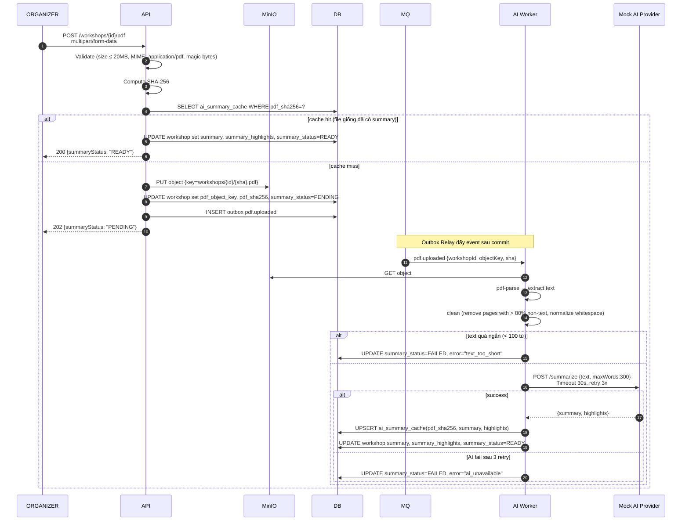

# Đặc tả: AI Summary từ PDF

## Mô tả

Cho phép `ORGANIZER` upload file PDF giới thiệu workshop. Hệ thống tự động:

1. Lưu PDF vào MinIO.
2. Trích xuất văn bản.
3. Làm sạch (loại header/footer, normalize whitespace).
4. Gọi AI Provider để sinh **bản tóm tắt 200–300 từ** + **5 bullet points highlights**.
5. Hiển thị tóm tắt trên trang chi tiết workshop cho SV.

Toàn bộ pipeline **bất đồng bộ** (không block request upload).

## Luồng chính

> Rendered PNG with white background. Local fallback: `../assets/diagrams-png/specs-ai-summary-01-luong-chinh.png`. Mermaid source below is kept for editing.

### A. Cache theo SHA-256

- Cùng 1 file PDF (cùng SHA-256) → tái sử dụng summary cũ (không gọi AI lại).
- Bảng `ai_summary_cache(pdf_sha256 PRIMARY KEY)` lưu summary dùng chung.
- Cột `workshops.pdf_sha256` **không unique** vì nhiều workshop có thể dùng cùng một PDF.
- Tiết kiệm chi phí AI và rút ngắn thời gian cho file phổ biến.

### B. Frontend behavior

1. Sau upload, admin web hiển thị `summaryStatus: PENDING` với spinner.
2. Polling `GET /workshops/{id}` mỗi 5s; khi `READY` → hiển thị summary.
3. Trang chi tiết SV cũng hiển thị summary nếu `READY`; nếu `PENDING` → "Đang tạo tóm tắt..."; nếu `FAILED` → ẩn (chỉ hiển thị description gốc).

### C. Re-trigger thủ công

`POST /workshops/{id}/summary/retry` (ORGANIZER only) → đẩy event lại vào queue, `summary_status=PENDING`.

## Kịch bản lỗi

| Tình huống                                     | Phản ứng                                                                            |
| ---------------------------------------------- | ----------------------------------------------------------------------------------- |
| File quá lớn (>20MB)                           | 413 `file_too_large`                                                                |
| Sai MIME / magic bytes                         | 415 `unsupported_media_type`                                                        |
| File chứa mã độc / corrupt                     | pdf-parse throw → mark `FAILED`                                                     |
| PDF chỉ có ảnh (scan)                          | Không OCR ở phiên bản 1.0 → mark `FAILED` với hint "PDF không có text"              |
| AI provider timeout                            | Retry 3 lần (10s, 30s, 90s) → fail                                                  |
| AI provider trả nội dung > 300 từ              | Truncate hoặc retry với prompt nghiêm hơn                                           |
| AI provider trả nội dung tục/phản cảm          | Filter cơ bản (regex blocklist), nếu vẫn đáng nghi → mark `FAILED` chờ admin review |
| MinIO down lúc upload                          | 503 `storage_unavailable`                                                           |
| MinIO down lúc worker đọc                      | Retry với backoff                                                                   |
| Worker chết giữa lúc xử lý                     | RabbitMQ manual ack — không ack nếu chưa xong → message redeliver                   |
| Network slow → upload mất 2 phút               | Cho phép, response 202 được trả ngay; xử lý tiếp tục async                          |
| Admin upload PDF mới khi summary cũ chưa ready | Cancel job cũ (set status PENDING_NEW), xử lý file mới                              |

## Ràng buộc

- **Bảo mật**:
  - Validate magic bytes (`%PDF-`) ngoài MIME header.
  - Phiên bản demo kiểm tra MIME type, magic bytes (`%PDF-`) và giới hạn size; ClamAV được ghi nhận là hướng mở rộng khi triển khai production.
  - Presigned URL cho download có TTL ngắn.
- **Hiệu năng**:
  - Upload p95 < 5s với file 5MB.
  - Pipeline AI từ upload → READY: p95 < 30s với file 5MB / 10 trang.
- **Chi phí**:
  - Cache theo SHA giảm gọi AI.
  - Giới hạn file 20MB và text 50K ký tự (truncate trước khi gọi AI).
- **Khả dụng**:
  - AI down không ảnh hưởng các tính năng khác.
  - Workshop vẫn xem được dù summary `FAILED`.

## Tiêu chí chấp nhận

- [ ] AC-01: Upload PDF 5MB → API trả 202 trong < 5s.
- [ ] AC-02: Sau ≤ 30s, `GET /workshops/{id}` trả `summaryStatus=READY` với `summary` 200–300 từ.
- [ ] AC-03: Upload file >20MB → 413.
- [ ] AC-04: Upload file giả PDF (đổi đuôi từ .exe) → 415.
- [ ] AC-05: Bật `MOCK_AI_DOWN=true` → worker retry 3 lần → mark `FAILED`; trang SV vẫn xem được, hiển thị description gốc.
- [ ] AC-06: Upload cùng file PDF (cùng SHA) cho 2 workshop khác nhau → workshop thứ 2 dùng lại summary, không gọi AI.
- [ ] AC-07: Worker chết giữa chừng → restart → message redeliver → hoàn thành đúng.
- [ ] AC-08: Admin retry summary failed → status `PENDING` rồi `READY`.
- [ ] AC-09: PDF chỉ có ảnh (test) → mark `FAILED` với error rõ.
- [ ] AC-10: Metrics `ai_summary_duration_seconds` và `ai_summary_failures_total` được expose ở `/metrics`.
