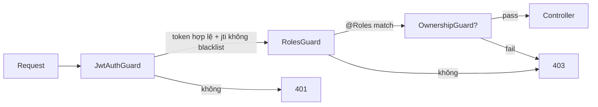

# Đặc tả: Authentication & Authorization (RBAC)

## Mô tả

Tính năng xác thực và phân quyền của hệ thống UniHub Workshop. Bao gồm:

- Đăng ký, đăng nhập, đăng xuất, refresh token cho 4 nhóm người dùng (`STUDENT`, `ORGANIZER`, `CHECKIN_STAFF`, `SYS_ADMIN`).
- Cấp phát Access Token (JWT RS256, TTL 15 phút) + Refresh Token (DB-backed, TTL 7 ngày).
- Kiểm tra quyền theo Role-Based Access Control ở 3 lớp: Edge (Nginx) → Backend Guards (NestJS) → Domain rules.

## Luồng chính

### A. Đăng ký tài khoản sinh viên

1. SV nhập email, mật khẩu, MSSV, họ tên trên Student Web.
2. `POST /auth/register` (rate-limited: 3 req/giờ/IP).
3. Backend kiểm tra:
   - Email chưa tồn tại trong `users`.
   - MSSV tồn tại trong bảng `students` (đồng bộ từ CSV) **và** `is_active=true`.
   - Thông tin họ tên + email trong `users` khớp với `students` (nếu CSV có email).
4. Tạo bản ghi `users` (password bcrypt cost 12) và gán `role=STUDENT`.
5. Trả 201 + access_token + refresh_token.

### B. Đăng nhập

1. `POST /auth/login` với `{email, password}`.
2. Backend tìm user, so password bằng bcrypt.
3. Nếu sai 5 lần liên tiếp trong 15 phút → khoá đăng nhập 30 phút (Redis key `lockout:{email}`).
4. Sinh JWT access token với claims:
   ```json
   { "sub": "<userId>", "roles": ["STUDENT"], "jti": "<uuid>", "iat": ..., "exp": ... }
   ```
5. Sinh refresh token (random 256-bit), lưu vào `refresh_tokens` table (`user_id`, `token_hash`, `expires_at`, `revoked_at`).
6. Trả 200 + cả 2 token.

### C. Refresh Token

1. `POST /auth/refresh` với `{refreshToken}`.
2. Hash token, tra DB. Nếu không tồn tại / `revoked_at IS NOT NULL` / hết hạn → 401.
3. **Token rotation**: set `revoked_at=now()` cho refresh cũ, cấp refresh mới + access mới.
4. Trả 200.

### D. Đăng xuất

1. `POST /auth/logout` (yêu cầu access token hợp lệ).
2. Revoke refresh token (`UPDATE refresh_tokens SET revoked_at=now()`).
3. Đẩy `jti` của access token vào Redis `jwt:blacklist:{jti}` với TTL = `exp - now`.

### E. Kiểm tra quyền trên mỗi request (Backend)


> Rendered PNG with white background. Local fallback: `../assets/diagrams-png/specs-auth-01-e-kiem-tra-quyen-tren-moi-request-backend.png`. Mermaid source below is kept for editing.



### F. Reset mật khẩu (out of scope phần 1, chỉ design)

Mô tả ngắn: gửi link kèm token TTL 30 phút qua email.

### G. Bootstrap tài khoản nội bộ

1. Seed `SYS_ADMIN` đầu tiên từ env `BOOTSTRAP_ADMIN_EMAIL` và `BOOTSTRAP_ADMIN_PASSWORD` khi chạy seed script.
2. `SYS_ADMIN` đăng nhập Admin Web và tạo tài khoản `ORGANIZER` / `CHECKIN_STAFF` bằng `POST /admin/users`.
3. `SYS_ADMIN` gán role bằng `POST /admin/users/{id}/roles`.
4. Mọi thay đổi role ghi `audit_logs` và chỉ có hiệu lực chắc chắn sau lần refresh token tiếp theo (tối đa 15 phút theo access token TTL).

## Kịch bản lỗi

| Tình huống                                         | Phản ứng                                                                  |
| -------------------------------------------------- | ------------------------------------------------------------------------- |
| Email đã tồn tại khi đăng ký                       | 409 `email_already_used`                                                  |
| MSSV không có trong bảng `students`                | 422 `student_not_found` (kèm hint "Liên hệ phòng đào tạo")                |
| MSSV bị `is_active=false` (đã tốt nghiệp/nghỉ)     | 422 `student_inactive`                                                    |
| Mật khẩu sai 5 lần                                 | 423 `account_locked`, header `Retry-After: 1800`                          |
| Token hết hạn                                      | 401 `token_expired` (client tự refresh)                                   |
| Refresh token bị reuse (đã revoke)                 | 401 + revoke **toàn bộ** refresh token của user (token theft suspected)   |
| JWT bị tampering                                   | 401 `invalid_signature`                                                   |
| Truy cập endpoint không đủ quyền                   | 403 `insufficient_permission` (không tiết lộ tài nguyên có tồn tại không) |
| Redis down (blacklist không truy cập được)         | Chấp nhận rủi ro nhỏ — vẫn cho qua nếu signature hợp lệ; log warning      |
| MSSV hợp lệ nhưng đã có account khác dùng          | 409 `student_code_already_linked`                                         |
| Thiếu env bootstrap admin khi DB chưa có SYS_ADMIN | Seed script fail-fast, không chạy app ở trạng thái không có admin         |

## Ràng buộc

- **Bảo mật**:
  - Bcrypt cost ≥ 12.
  - JWT ký bằng **RS256** (private key chỉ ở server, public key có thể phát cho mobile để verify QR offline).
  - HTTPS bắt buộc trong production; trong demo Docker dùng self-signed.
  - Không log raw password / token vào file log.
  - CORS whitelist chỉ origin của 3 frontend.
- **Hiệu năng**:
  - `POST /auth/login` p95 < 300 ms (bcrypt là chi phí chính).
  - Verify JWT không gọi DB (stateless), chỉ tra Redis blacklist (1 lookup).
- **Tính nhất quán**:
  - Token rotation chống reuse refresh token.
  - Logout phải invalidate được trong < 5 giây trên mọi instance backend (qua Redis).
- **Audit**:
  - Mọi sự kiện `login_success`, `login_failed`, `logout`, `refresh`, `role_changed` ghi vào `audit_logs`.

## Tiêu chí chấp nhận

- [ ] AC-01: SV đăng ký thành công khi MSSV tồn tại trong `students`; nhận access + refresh token.
- [ ] AC-02: SV đăng ký với MSSV không có trong `students` → 422.
- [ ] AC-03: Đăng nhập sai 5 lần → khoá 30 phút; sau 30 phút unlock tự động.
- [ ] AC-04: Access token TTL 15 phút; sau khi hết hạn, request trả 401, client tự refresh thành công.
- [ ] AC-05: Refresh token đã rotate (sau `/auth/refresh`) không dùng lại được → 401 + revoke toàn bộ.
- [ ] AC-06: Logout → access token đó (cùng `jti`) không thể dùng tiếp dù chưa hết exp.
- [ ] AC-07: SV gọi `POST /workshops` → 403 (chỉ ORGANIZER được).
- [ ] AC-08: ORGANIZER gọi `POST /checkin/batch` → 403 (chỉ CHECKIN_STAFF được).
- [ ] AC-09: SV gọi `GET /registrations/{id}` của SV khác → 403 (OwnershipGuard).
- [ ] AC-10: SYS_ADMIN gán role `ORGANIZER` cho user khác → user đó truy cập được endpoint organizer ngay sau lần refresh tiếp theo (TTL 15 phút).
- [ ] AC-11: JWT bị sửa payload → 401 `invalid_signature`.
- [ ] AC-12: Tất cả endpoint POST sửa đổi data đều có log audit.
- [ ] AC-13: Fresh DB chạy seed → có đúng 1 tài khoản SYS_ADMIN bootstrap; thiếu env bootstrap thì seed fail rõ lỗi.
