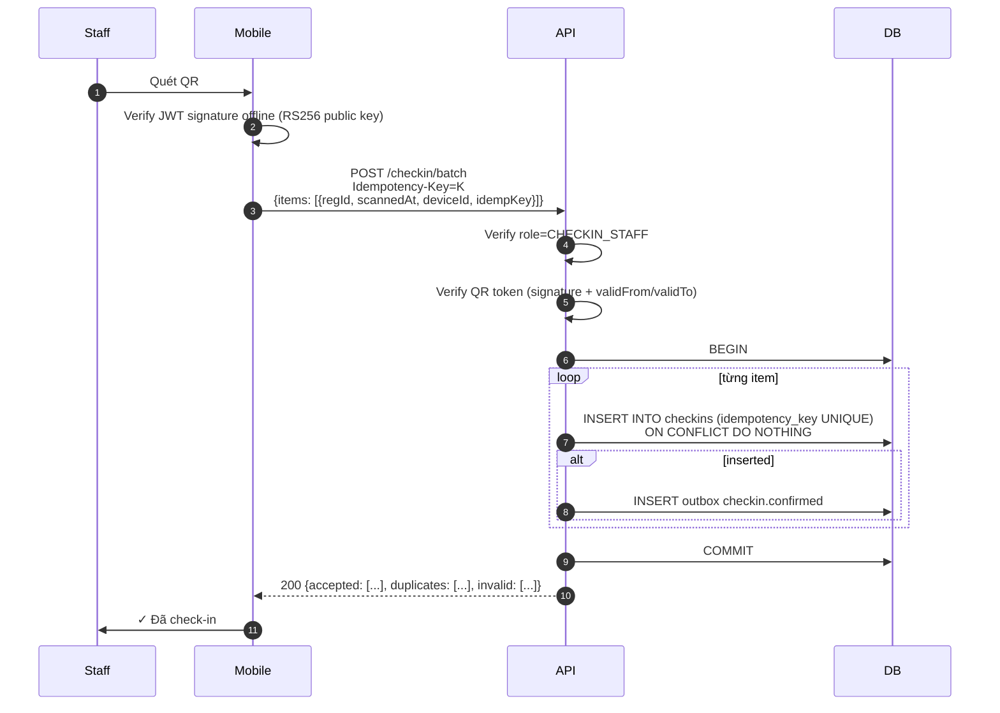
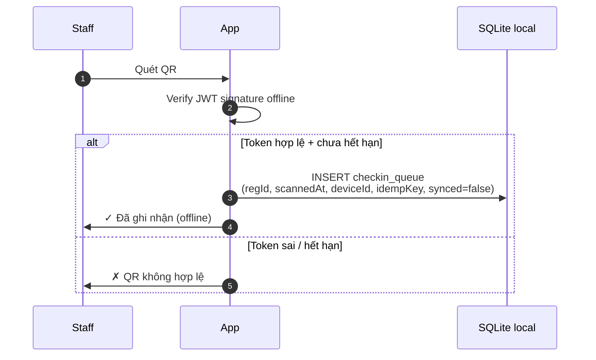
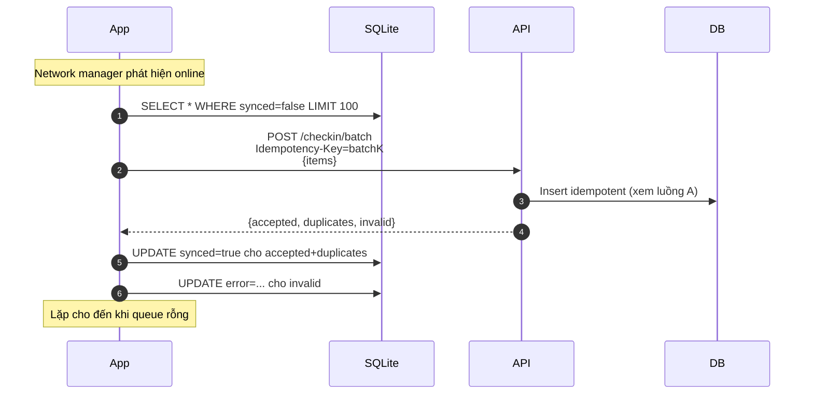

# Đặc tả: Check-in tại sự kiện (Online + Offline)

## Mô tả

Tính năng check-in cho nhân sự (`CHECKIN_STAFF`) tại cửa phòng workshop, dùng mobile app quét QR. **Phải hoạt động kể cả khi mất mạng**, không được mất dữ liệu khi kết nối phục hồi.

## Luồng chính

### A. Khi có mạng (online)


> Rendered PNG with white background. Local fallback: `../assets/diagrams-png/specs-checkin-01-a-khi-co-mang-online.png`. Mermaid source below is kept for editing.



### B. Khi mất mạng (offline)


> Rendered PNG with white background. Local fallback: `../assets/diagrams-png/specs-checkin-02-b-khi-mat-mang-offline.png`. Mermaid source below is kept for editing.



### C. Đồng bộ khi có mạng trở lại


> Rendered PNG with white background. Local fallback: `../assets/diagrams-png/specs-checkin-03-c-ong-bo-khi-co-mang-tro-lai.png`. Mermaid source below is kept for editing.



### D. Verify đơn lẻ (xem chi tiết SV trước khi check-in)

1. Staff quét QR.
2. App gọi `GET /registrations/{regId}/verify` (online).
3. Backend trả `{studentName, studentCode, workshopTitle, alreadyCheckedIn:bool}`.
4. App hiển thị xác nhận; staff bấm "Check-in" → đi vào luồng A.

### E. QR Token format

JWT RS256 (xem `specs/registration.md` section E):

```json
{
  "regId": "<uuid>",
  "workshopId": "<uuid>",
  "studentId": "<uuid>",
  "validFrom": "<timestamp>",
  "validTo": "<timestamp>",
  "exp": "<timestamp>",
  "jti": "<uuid>"
}
```

Mobile cache **public key** (lấy lúc login từ `GET /auth/jwks`) để verify offline. Public key invalidate khi rotate (rotation hằng năm).

### F. Idempotency Key cho từng quét

```
idempKey = sha256(regId + deviceId + scannedAtMillis)
```

Dùng làm UNIQUE trong DB. Cùng 1 lần quét gửi nhiều lần (do batch retry) chỉ tạo 1 bản ghi.

## Kịch bản lỗi

| Tình huống                                      | Phản ứng                                                                                                                          |
| ----------------------------------------------- | --------------------------------------------------------------------------------------------------------------------------------- |
| QR token sai signature                          | App reject ngay (offline check); 401 nếu lên server                                                                               |
| QR token hết hạn (`exp < now`)                  | App reject với message rõ                                                                                                         |
| QR token bị revoke (Redis `qr:revoked:{regId}`) | Server kiểm tra khi online; trả `revoked=true`                                                                                    |
| Workshop chưa bắt đầu (`now < validFrom`)       | Reject với `not_yet_valid`                                                                                                        |
| Workshop đã kết thúc (`now > validTo + 1h`)     | Reject `expired`                                                                                                                  |
| Đã check-in trước đó                            | Trả `duplicate` (không lỗi); app hiển thị "Đã check-in lúc HH:MM"                                                                 |
| Registration `CANCELLED`/`EXPIRED`              | 422 `invalid_registration`                                                                                                        |
| Mất mạng giữa batch sync                        | Server đã commit phần đầu; app retry phần còn lại với cùng `idempKey` → idempotent OK                                             |
| Device clock sai (offline timestamp lệch)       | Server tin `scannedAt` của client nhưng kẹp vào `[validFrom, validTo+1h]`; nếu lệch quá → log warning, vẫn chấp nhận trong khoảng |
| Staff dùng nhầm phòng (workshop ở phòng khác)   | Server check `workshop.room_id == staff.assignedRoomId` (assigned khi login shift); cảnh báo trên app trước khi confirm           |
| QR bị chụp ảnh, dùng lại sau khi SV đã rời      | Đã có `UNIQUE (registration_id)` → lần thứ 2 sẽ duplicate                                                                         |
| Mobile app bị xoá data lúc còn item chưa sync   | Ngoài đảm bảo phần mềm thông thường; mitigation: app chặn logout/clear data và cảnh báo mạnh nếu queue chưa rỗng                  |
| Server trả 500 lúc batch                        | App giữ items trong SQLite, retry sau 30s                                                                                         |

## Ràng buộc

- **Khả dụng offline**:
  - App phải check-in được hoàn toàn offline (verify QR + ghi local).
  - Queue local không giới hạn (giả định 1 phòng max 200 SV).
- **Tính nhất quán**:
  - Sau khi sync, không có bản ghi nào bị mất hoặc trùng trong điều kiện app không bị xoá local storage / thiết bị không factory reset.
  - 1 registration = 1 check-in (DB UNIQUE).
  - SQLite bật WAL mode để chống hỏng queue khi app crash.
- **Hiệu năng**:
  - Quét + verify offline: < 1 giây.
  - Sync 100 items: < 3 giây.
  - **Mục tiêu UX**: tổng thời gian check-in / SV ≤ 5 giây (vs 40s thủ công).
- **Bảo mật**:
  - QR token có TTL ngắn hạn.
  - Public key cache trong app, chống QR giả.
  - Staff phải đăng nhập với role `CHECKIN_STAFF`; mỗi shift đăng ký phòng phụ trách.
- **Quan sát**:
  - Metrics: `checkin_total{result}`, `checkin_offline_queue_size`, `checkin_sync_duration_ms`.

## Tiêu chí chấp nhận

- [ ] AC-01: Mạng tốt: quét 1 QR → response ≤ 1s, DB ghi `checkins` đúng 1 dòng.
- [ ] AC-02: Bật airplane mode → quét 5 QR khác nhau → app hiển thị "Đã ghi nhận (offline)" + SQLite có 5 dòng `synced=false`.
- [ ] AC-03: Tắt airplane mode → app tự sync trong < 5s → DB có 5 `checkins` mới + SQLite `synced=true`.
- [ ] AC-04: Quét cùng 1 QR 3 lần (online) → 1 lần CONFIRMED, 2 lần `duplicate`; UI hiển thị thân thiện.
- [ ] AC-05: Quét QR đã sửa payload → app reject offline (sai signature), không cho lên server.
- [ ] AC-06: Server trả 500 lúc sync batch → app retry sau 30s và thành công.
- [ ] AC-07: SV đã check-in xong, in-app notification gửi đến SV trong < 5s (online).
- [ ] AC-08: Mobile app crash giữa lúc đang quét → SQLite không bị hỏng (WAL mode), khởi động lại tiếp tục sync.
- [ ] AC-09: 1 staff dùng nhầm phòng → app cảnh báo trước khi confirm.
- [ ] AC-10: Sync batch idempotent: gọi 2 lần cùng items → kết quả y hệt, DB không bị nhân đôi.
- [ ] AC-11: App có queue chưa sync → không cho logout/clear local data nếu user chưa xác nhận cảnh báo rủi ro.
