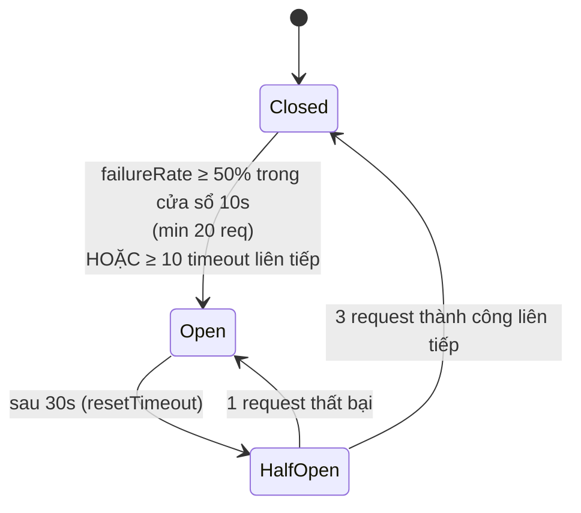
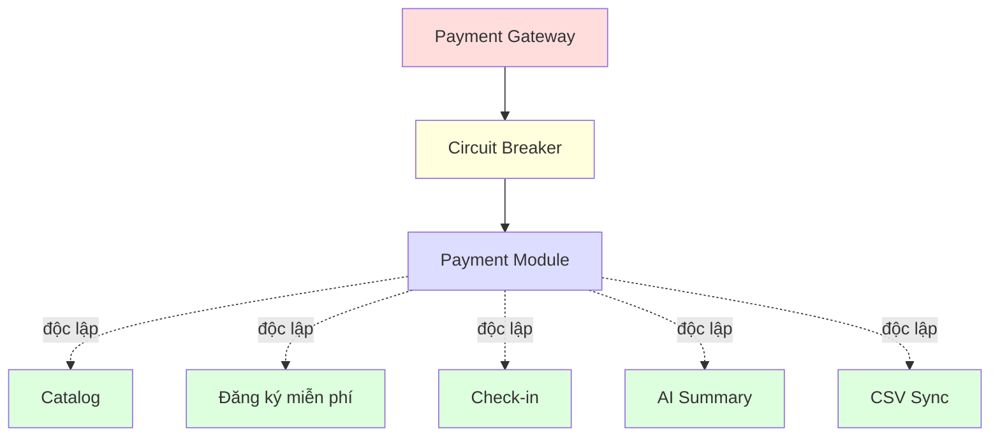

# Đặc tả: Circuit Breaker + Graceful Degradation (Bảo vệ khỏi Payment Gateway lỗi)

## Mô tả

Cơ chế chặn cascade failure khi cổng thanh toán không ổn định:

- **Fail-fast** khi gateway down → không tốn thread/connection chờ timeout.
- **Tự phục hồi** khi gateway khoẻ lại.
- **Graceful Degradation**: các tính năng không liên quan thanh toán **vẫn hoạt động**.

## Luồng chính

### A. Mô hình 3 trạng thái


> Rendered PNG with white background. Local fallback: `../assets/diagrams-png/specs-circuit-breaker-01-a-mo-hinh-3-trang-thai.png`. Mermaid source below is kept for editing.



| Trạng thái    | Hành vi                                                                               |
| ------------- | ------------------------------------------------------------------------------------- |
| **Closed**    | Gọi gateway bình thường. Đếm thành công/thất bại trong rolling window.                |
| **Open**      | Không gọi gateway. Trả lỗi ngay (`503 payment_unavailable`, `< 50ms`).                |
| **Half-Open** | Cho qua tối đa 1 probe request. Thành công liên tiếp 3 lần → Closed. Thất bại → Open. |

### B. Cấu hình (`opossum`)

```ts
const breaker = new CircuitBreaker(paymentClient.charge.bind(paymentClient), {
  timeout: 3000, // mỗi call timeout 3s
  errorThresholdPercentage: 50, // ngưỡng mở khi tỉ lệ lỗi >= 50%
  resetTimeout: 30000, // thời gian giữ Open trước khi sang Half-Open
  rollingCountTimeout: 10000, // cửa sổ thống kê 10s
  rollingCountBuckets: 10,
  volumeThreshold: 20, // tối thiểu 20 req trong cửa sổ mới tính tỉ lệ
  name: 'payment-gateway',
});

breaker.fallback((err) => ({
  status: 'unavailable',
  code: 'PAYMENT_DOWN',
  retryAfterSec: 30,
}));

breaker.on('open', () => metrics.gauge('payment.circuit_state', 1));
breaker.on('halfOpen', () => metrics.gauge('payment.circuit_state', 0.5));
breaker.on('close', () => metrics.gauge('payment.circuit_state', 0));
breaker.on('failure', () => metrics.counter('payment.failure_total').inc());
```

### C. Lý do tham số

| Tham số                        | Lý do                                                                  |
| ------------------------------ | ---------------------------------------------------------------------- |
| `timeout: 3000`                | Đủ cho gateway thật xử lý; vượt nghĩa là đang treo, fail nhanh tốt hơn |
| `errorThresholdPercentage: 50` | Tỉ lệ thất bại 50% rõ ràng là gateway có vấn đề                        |
| `volumeThreshold: 20`          | Tránh mở Open do 1-2 request lẻ thất bại                               |
| `rollingCountTimeout: 10s`     | Đủ ngắn để phản ứng nhanh, đủ dài để có ý nghĩa thống kê               |
| `resetTimeout: 30s`            | Cho gateway thời gian phục hồi; không quá lâu làm UX kém               |

### D. Graceful Degradation — Cô lập Payment khỏi phần còn lại


> Rendered PNG with white background. Local fallback: `../assets/diagrams-png/specs-circuit-breaker-02-d-graceful-degradation-co-lap-payment-khoi-phan-con-lai.png`. Mermaid source below is kept for editing.



**Nguyên tắc**:

- Module nghiệp vụ khác **không gọi đồng bộ** vào `PaymentService`.
- Các side-effect hậu thanh toán/refund/notification đi qua **event** (RabbitMQ) — async, có thể chậm nhưng không block request chính.
- Frontend đọc `GET /system/health/payment` (cached 5s) để biết tình trạng → hiển thị banner "Cổng thanh toán đang bảo trì" + ẩn nút thanh toán → không cho user thử và lỗi.

### E. Hành vi từng nhánh khi Circuit Open

| Tính năng                                               | Hành vi khi PG Open                                                         |
| ------------------------------------------------------- | --------------------------------------------------------------------------- |
| Catalog (`GET /workshops`)                              | ✅ Bình thường                                                              |
| Đăng ký miễn phí (`POST /registrations` workshop fee=0) | ✅ Bình thường                                                              |
| Đăng ký có phí (`POST /registrations` workshop fee>0)   | ✅ Tạo `PENDING_PAYMENT` với hold ngắn (5 phút thay vì 15); banner cảnh báo |
| Thanh toán (`POST /payments`)                           | ❌ 503 `payment_unavailable` ngay (< 50ms); UI hướng dẫn thử lại sau        |
| Webhook callback (`POST /payments/callback`)            | ✅ Vẫn nhận (không gọi ra ngoài, chỉ ghi DB)                                |
| Check-in                                                | ✅ Bình thường                                                              |
| AI Summary                                              | ✅ Bình thường                                                              |
| CSV Sync                                                | ✅ Bình thường                                                              |
| Notification                                            | ✅ Bình thường                                                              |
| Refund (gọi ra PG)                                      | Enqueue refund job → retry khi Closed                                       |

## Kịch bản lỗi

| Tình huống                                      | Phản ứng                                                                     |
| ----------------------------------------------- | ---------------------------------------------------------------------------- |
| Gateway timeout liên tục                        | Circuit ghi failure; sau khi đủ ngưỡng chuyển Open                           |
| Gateway trả 5xx vượt 50% trong 10s              | Circuit Open, request payment mới fail-fast                                  |
| Gateway phục hồi sau Open                       | Sau `resetTimeout`, circuit chuyển Half-Open và chỉ cho probe request        |
| Probe Half-Open thất bại                        | Circuit quay lại Open ngay, không cho traffic hàng loạt                      |
| Circuit Open nhưng gateway gửi webhook          | Webhook vẫn được nhận vì không gọi outbound gateway                          |
| Refund cần gọi gateway khi Circuit Open         | Enqueue refund job, retry khi circuit Closed                                 |
| Một backend instance Open, instance khác Closed | Chấp nhận sai lệch nhỏ; metrics giúp phát hiện; scope đồ án ưu tiên đơn giản |
| Endpoint health bị gọi nhiều                    | Cache trạng thái payment health 5 giây                                       |

## Ràng buộc

### A. Stateful per-instance

- Trạng thái Circuit lưu in-memory mỗi backend instance.
- Khi scale ngang nhiều instance, mỗi instance tự thống kê — chấp nhận sai lệch nhỏ (1 instance có thể Closed trong khi 2 instance khác Open).
- Trade-off đơn giản hoá; distributed circuit (qua Redis) phức tạp và có race.

### B. Quan sát

Metrics expose tại `/metrics`:

- `payment_circuit_state{name}` (gauge: 0=Closed, 0.5=HalfOpen, 1=Open)
- `payment_request_total{status="success|failure|timeout|short_circuit"}` (counter)
- `payment_latency_seconds` (histogram)

Endpoint `GET /system/health/payment` trả:

```json
{
  "circuit": "open",
  "since": "2026-04-25T10:00:00Z",
  "lastError": "ECONNREFUSED",
  "stats": { "successes": 0, "failures": 25, "timeouts": 12 }
}
```

## Tiêu chí chấp nhận

- [ ] AC-01: Bật `MOCK_PG_DOWN=true` → trong < 30s circuit chuyển Open (sau 20+ requests fail).
- [ ] AC-02: Khi Open, `POST /payments` trả 503 trong < 50ms (không tốn 3s timeout).
- [ ] AC-03: Khi Open, `GET /workshops` vẫn trả 200 bình thường (Graceful Degradation).
- [ ] AC-04: Khi Open, đăng ký workshop **miễn phí** vẫn thành công.
- [ ] AC-05: Khi Open, đăng ký workshop **có phí** → tạo registration `PENDING_PAYMENT` với hold 5 phút + banner cảnh báo.
- [ ] AC-06: Tắt `MOCK_PG_DOWN=false` → sau 30s, Circuit chuyển Half-Open → 3 request đầu thành công → Closed.
- [ ] AC-07: Half-Open thử request thất bại → quay về Open ngay, đợi thêm 30s.
- [ ] AC-08: Endpoint `GET /system/health/payment` trả đúng trạng thái circuit.
- [ ] AC-09: Frontend ẩn nút "Thanh toán" khi `circuit=open` (cache 5s).
- [ ] AC-10: Metrics `payment_circuit_state` chuyển đúng theo state; `/metrics` Prometheus scrape được.
- [ ] AC-11: Demo bằng load test: bật DOWN trong 60s, hệ thống phục vụ 3000 RPS các endpoint khác không bị ảnh hưởng (latency p95 không tăng > 20%).
