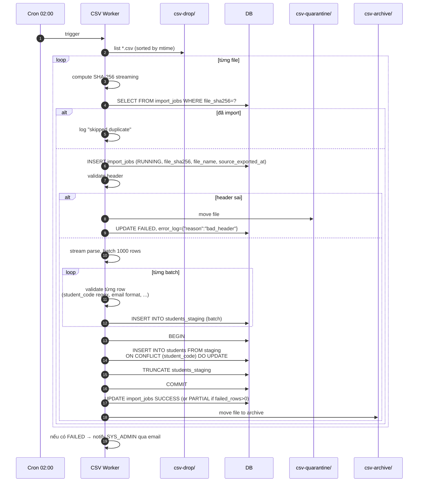

# Đặc tả: Đồng bộ dữ liệu sinh viên qua CSV

## Mô tả

Hệ thống sinh viên cũ của trường **không có API**. Mỗi đêm 01:00, hệ thống cũ export 1 file CSV (~30K dòng) vào thư mục `data/csv-drop/`. UniHub cần định kỳ:

- Phát hiện file mới.
- Validate, parse, upsert vào bảng `students`.
- Quarantine file lỗi format.
- Ghi log đầy đủ vào `import_jobs`.
- **Không gây downtime** cho hệ thống đang chạy.

### CSV format

```csv
student_code,full_name,email,faculty,cohort,is_active
21127001,Nguyễn Văn A,a@student.edu.vn,CNTT,2021,true
21127002,Trần Thị B,,CNTT,2021,true
...
```

- Encoding: UTF-8 (BOM optional).
- Delimiter: `,`. Quote: `"`.
- Header bắt buộc đúng thứ tự cột.
- `source_exported_at` lấy từ timestamp trong tên file, ví dụ `students_20260425_010000.csv`; nếu không parse được thì dùng `mtime` của file và log warning.

## Luồng chính


> Rendered PNG with white background. Local fallback: `../assets/diagrams-png/specs-csv-sync-01-luong-chinh.png`. Mermaid source below is kept for editing.



### A. Validate từng dòng

Reject dòng nếu:

- `student_code` không match `^[0-9]{8,10}$`.
- `full_name` rỗng hoặc > 255 ký tự.
- `email` không null nhưng không match regex.
- `is_active` không phải `true|false|1|0`.

Dòng lỗi → ghi vào `error_log` JSON của import_jobs:

```json
{ "failed_rows": [{ "line": 42, "reason": "invalid_student_code", "raw": "ABC123" }] }
```

### B. Upsert idempotent

```sql
INSERT INTO students (student_code, full_name, email, faculty, cohort, is_active, source_exported_at, last_synced_at)
SELECT student_code, full_name, email, faculty, cohort, is_active, source_exported_at, now()
FROM students_staging
ON CONFLICT (student_code) DO UPDATE SET
    full_name      = EXCLUDED.full_name,
    email          = EXCLUDED.email,
    faculty        = EXCLUDED.faculty,
    cohort         = EXCLUDED.cohort,
    is_active      = EXCLUDED.is_active,
    source_exported_at = EXCLUDED.source_exported_at,
    last_synced_at = EXCLUDED.last_synced_at
WHERE students.source_exported_at IS NULL
   OR EXCLUDED.source_exported_at >= students.source_exported_at;
```

### C. Schedule

- Cron: `0 2 * * *` (02:00 mỗi ngày).
- Có endpoint `POST /admin/csv-sync/run` (SYS_ADMIN only) để trigger thủ công khi cần.
- Sau khi worker chạy xong, audit log + notification cho SYS_ADMIN nếu có lỗi.

### D. Hành vi với SV đã đăng ký nhưng `is_active=false` sau import

- Không xoá registration cũ.
- Khi SV này login / đăng ký workshop mới → reject (kiểm tra `students.is_active` trong domain layer).
- Ban tổ chức có thể xem danh sách registration của SV inactive trong admin.

## Kịch bản lỗi

| Tình huống                      | Phản ứng                                                                    |
| ------------------------------- | --------------------------------------------------------------------------- |
| File trùng (cùng SHA-256)       | Skip — UNIQUE constraint trên `import_jobs.file_sha256`                     |
| File rỗng                       | Mark `FAILED` "empty_file"; quarantine                                      |
| Header sai                      | Quarantine; không xử lý dòng nào                                            |
| Encoding sai (CP1258)           | Detect bằng BOM/heuristic; fail nếu không phải UTF-8                        |
| Một số dòng lỗi format          | Continue, ghi vào `error_log`; status `PARTIAL`                             |
| Toàn bộ dòng lỗi                | Mark `FAILED`, không commit gì                                              |
| File rất lớn (>1M dòng)         | Stream parse + batch insert; không load full file vào RAM                   |
| DB connection drop giữa chừng   | Transaction rollback (chỉ batch hiện tại); retry job từ đầu file            |
| Worker chết giữa lúc xử lý      | Job có status `RUNNING` quá 30 phút → admin có thể retry; lock optimistic   |
| 2 worker chạy cùng lúc          | DB advisory lock `pg_advisory_lock(csv_sync)` → chỉ 1 chạy                  |
| File có byte ngoài UTF-8        | Detect và quarantine; log dòng đầu lỗi                                      |
| Cron không chạy đúng giờ        | Out-of-band: `POST /admin/csv-sync/run` thủ công                            |
| Tích lũy nhiều file chưa import | Worker xử lý FIFO theo `mtime`; mỗi run xử lý nhiều file đến hết            |
| File cũ được drop sau file mới  | Upsert so `source_exported_at`, không overwrite dữ liệu mới bằng dữ liệu cũ |

## Ràng buộc

- **Không downtime**:
  - Không khoá bảng `students`.
  - UPSERT theo batch 1000 dòng, không single transaction toàn file.
- **Tính nhất quán**:
  - SHA-256 đảm bảo không import 2 lần.
  - Idempotent UPSERT.
  - `source_exported_at` chống stale file overwrite dữ liệu mới.
- **Quan sát**:
  - Mọi job có row trong `import_jobs` (audit).
  - Endpoint `GET /admin/import-jobs?status=FAILED` cho SYS_ADMIN.
  - Notification email cho SYS_ADMIN khi `FAILED`.
- **Hiệu năng**:
  - File 30K dòng xử lý xong < 60 giây.
  - Bộ nhớ peak < 200MB (streaming).
- **Bảo mật**:
  - Folder `csv-drop/` chỉ readable bởi worker.
  - Không log raw email/họ tên ở mức INFO (PII), chỉ ở DEBUG.

## Tiêu chí chấp nhận

- [ ] AC-01: Drop file CSV 10K dòng → sau 60s thấy 10K rows trong `students` + `import_jobs` `SUCCESS`.
- [ ] AC-02: Drop file 10K dòng (5% lỗi format) → 9500 rows nhập, `import_jobs` `PARTIAL`, `error_log` chứa 500 entries.
- [ ] AC-03: Drop file giống hệt lần 2 → skip, không tăng row count, log "duplicate".
- [ ] AC-04: Drop file header sai → file vào `csv-quarantine/`, `import_jobs` `FAILED`, email gửi SYS_ADMIN.
- [ ] AC-05: Cron 02:00 chạy tự động (test với cron mỗi 1 phút).
- [ ] AC-06: `POST /admin/csv-sync/run` trả 202 và trigger ngay lập tức.
- [ ] AC-07: SV đã có registration → CSV update `is_active=false` → SV login OK nhưng đăng ký workshop mới bị reject.
- [ ] AC-08: 2 worker chạy đồng thời → 1 chạy, 1 đợi (advisory lock); không có duplicate insert.
- [ ] AC-09: File 30K dòng → xử lý < 60s, RAM peak < 200MB.
- [ ] AC-10: Job đang chạy → backend API vẫn phục vụ request bình thường (no lock contention).
- [ ] AC-11: Import file ngày mới rồi drop lại file cũ → dữ liệu trong `students` không bị rollback về bản cũ.
