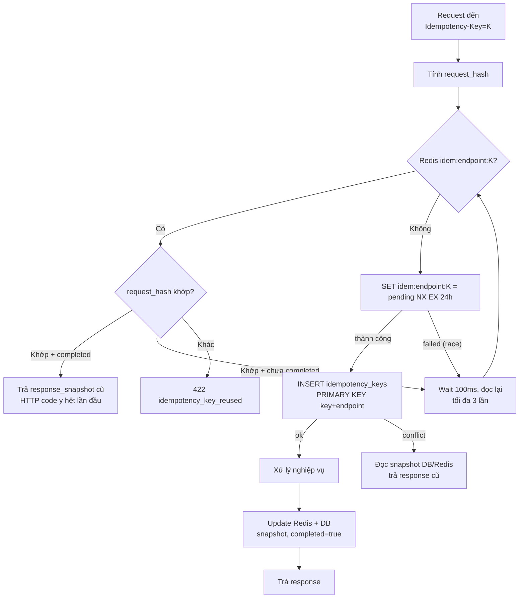

# Đặc tả: Idempotency Key (Chống thao tác trùng lặp)

## Mô tả

Cơ chế bảo đảm một thao tác (đặc biệt là thanh toán) **chỉ được thực hiện đúng một lần** dù client retry nhiều lần do mạng chập chờn, người dùng bấm 2 lần, hay server timeout.

Áp dụng cho:

- `POST /payments` — **bắt buộc**, không có header → 400.
- `POST /registrations` — **bắt buộc**.
- `POST /checkin/batch` — **bắt buộc** (mỗi item trong batch có `idempotency_key` riêng).
- `POST /workshops/{id}/pdf` — **khuyến nghị**.

## Luồng chính

### A. Cơ chế sinh key

| Client              | Cách sinh                                                                                                                           |
| ------------------- | ----------------------------------------------------------------------------------------------------------------------------------- |
| Web (Student/Admin) | `crypto.randomUUID()` lúc bắt đầu intent (user bấm "Thanh toán" / "Đăng ký"). Lưu trong React state cho tới khi nhận response cuối. |
| Mobile (Check-in)   | `expo-crypto.randomUUID()`. Mỗi quét QR sinh `idempKey = sha256(regId + deviceId + scannedAtMs)` lưu cùng item trong SQLite.        |

**Quy ước**: 1 intent = 1 key. Mọi retry trong cùng intent (do timeout/lỗi mạng) phải dùng cùng key.

### B. Header HTTP

```
Idempotency-Key: <uuid v4 hoặc 32–128 ký tự>
```

Thiếu hoặc sai format → `400 idempotency_key_required`.

### C. Nơi lưu trữ — 2 tầng

#### 1. Redis (primary, fast)

Key: `idem:{endpoint}:{key}` (TTL **24h**)
Value: JSON

```json
{
  "request_hash": "sha256(canonical_body)",
  "status_code": 200,
  "response_body": { "qrToken": "..." },
  "created_at": "2026-04-25T10:00:00Z",
  "completed": true
}
```

Trạng thái `completed: false` được set ngay khi bắt đầu xử lý, dùng để xử lý race (request 2 thấy entry chưa xong → đợi/đọc DB).

#### 2. PostgreSQL (durable, lâu dài)

Bảng generic `idempotency_keys` dùng cho mọi endpoint idempotent. Đây là backup khi Redis down/mất TTL và giúp replay response sau restart:

```sql
CREATE TABLE idempotency_keys (
    key            VARCHAR(128) NOT NULL,
    endpoint       VARCHAR(100) NOT NULL,
    user_id        UUID,
    request_hash   VARCHAR(64) NOT NULL,
    status_code    INT,
    response_body  JSONB,
    completed      BOOLEAN NOT NULL DEFAULT FALSE,
    created_at     TIMESTAMPTZ NOT NULL DEFAULT now(),
    expires_at     TIMESTAMPTZ NOT NULL,
    PRIMARY KEY (key, endpoint)
);
```

Riêng `payments.idempotency_key` vẫn có UNIQUE để chống duplicate charge dài hạn ngay cả khi snapshot `idempotency_keys` đã được dọn theo TTL.

### D. Cách kiểm tra trùng lặp (decision tree)


> Rendered PNG with white background. Local fallback: `../assets/diagrams-png/specs-idempotency-01-d-cach-kiem-tra-trung-lap-decision-tree.png`. Mermaid source below is kept for editing.



### E. Tính `request_hash`

```ts
const canonical = JSON.stringify(
  sortKeys({
    regId: body.regId,
    amount: body.amount,
    method: body.method,
  }),
);
const hash = sha256(canonical);
```

Chỉ hash các field định danh **intent**, bỏ qua field metadata thay đổi (timestamp client, request_id).

## Kịch bản lỗi

| Tình huống                                  | Kết quả                                                                                                                                                             |
| ------------------------------------------- | ------------------------------------------------------------------------------------------------------------------------------------------------------------------- |
| Cùng key + cùng payload, lần 1              | Xử lý bình thường, lưu snapshot                                                                                                                                     |
| Cùng key + cùng payload, lần 2+             | Trả snapshot cũ, **không gọi gateway**                                                                                                                              |
| Cùng key + payload khác                     | 422 `idempotency_key_reused`                                                                                                                                        |
| 2 request cùng key đồng thời                | Redis SET NX → 1 thắng; request thua đợi rồi đọc                                                                                                                    |
| Server crash giữa lúc xử lý                 | Redis có entry `completed: false`; request retry sẽ đợi nhưng không thấy hoàn tất → fallback DB lookup → nếu DB cũng không có row → DELETE Redis entry và xử lý lại |
| Redis mất key (TTL hết / FLUSHALL)          | `idempotency_keys` hoặc UNIQUE tài chính trong `payments` chặn trùng; trả response từ DB                                                                            |
| Client retry sau 24h+                       | Coi như intent mới (nên client không nên retry quá lâu); DB UNIQUE vẫn bảo vệ payment cũ                                                                            |
| Endpoint yêu cầu key nhưng client không gửi | 400 `idempotency_key_required`                                                                                                                                      |
| Key sai format hoặc dài > 128 ký tự         | 400 `invalid_idempotency_key`                                                                                                                                       |
| Snapshot DB chưa completed quá 5 phút       | Recovery job kiểm tra domain record; nếu chưa có side-effect thì xoá pending để retry                                                                               |

## Ràng buộc

### A. TTL

| Storage                       | TTL           | Lý do                                                         |
| ----------------------------- | ------------- | ------------------------------------------------------------- |
| Redis                         | **24 giờ**    | Đủ lâu cho retry hợp lý (vài phút), đủ ngắn để giải phóng RAM |
| `idempotency_keys` PostgreSQL | **24–72 giờ** | Durable replay sau restart; có thể dọn để tránh bảng phình to |
| `payments.idempotency_key`    | **Vĩnh viễn** | Ràng buộc UNIQUE chống duplicate charge dài hạn               |

### B. Áp dụng cho mỗi endpoint

#### `POST /payments`

- **Yêu cầu**: bắt buộc.
- **Đảm bảo**: không trừ tiền 2 lần. Snapshot bao gồm cả response 4xx/5xx (client retry → trả lỗi cũ chứ không gọi PG lần nữa).

#### `POST /registrations`

- **Yêu cầu**: bắt buộc.
- **Đảm bảo**: 1 intent đăng ký = 1 registration; 2 lần bấm = 1 registration.
- DB UNIQUE `(workshop_id, student_id)` đã chặn ở DB; idempotency cải thiện UX (trả lại regId cũ thay vì 409).

#### `POST /checkin/batch`

- **Yêu cầu**: header bắt buộc cho cả batch + mỗi item có `idempotency_key`.
- **Đảm bảo**: Mobile retry batch không tạo bản ghi trùng. Cùng 1 lần quét gửi nhiều lần → 1 row trong `checkins`.

#### `POST /workshops/{id}/pdf`

- **Khuyến nghị**: không bắt buộc (vì có cache theo SHA-256 file).
- Nếu có key, hỗ trợ retry upload không tạo nhiều object MinIO trùng.

### C. Implementation NestJS

```ts
@Injectable()
export class IdempotencyInterceptor implements NestInterceptor {
  async intercept(ctx: ExecutionContext, next: CallHandler) {
    const req = ctx.switchToHttp().getRequest();
    const res = ctx.switchToHttp().getResponse();
    const key = req.headers['idempotency-key'];
    if (!key) throw new BadRequestException('idempotency_key_required');

    const hash = canonicalHash(req.body);
    const endpoint = `${req.method} ${req.route.path}`;
    const redisKey = `idem:${endpoint}:${key}`;
    const cached = await this.redis.get(redisKey);

    if (cached) {
      const snap = JSON.parse(cached);
      if (snap.request_hash !== hash) {
        throw new UnprocessableEntityException('idempotency_key_reused');
      }
      if (snap.completed) {
        res.status(snap.status_code);
        return of(snap.response_body);
      }
      // Chưa hoàn tất: chờ ngắn rồi đọc DB fallback ở dưới.
    }

    const dbSnap = await this.idempotencyRepo.findOne({ key, endpoint });
    if (dbSnap) {
      if (dbSnap.request_hash !== hash) {
        throw new UnprocessableEntityException('idempotency_key_reused');
      }
      if (dbSnap.completed) {
        await this.redis.set(redisKey, JSON.stringify(dbSnap), 'EX', 86400);
        res.status(dbSnap.status_code);
        return of(dbSnap.response_body);
      }
    }

    const locked = await this.redis.set(
      redisKey,
      JSON.stringify({ request_hash: hash, completed: false, created_at: new Date() }),
      'EX',
      86400,
      'NX',
    );
    if (!locked) {
      return this.waitAndReplayFromRedisOrDb(redisKey, key, endpoint, hash, res);
    }

    await this.idempotencyRepo.insertPending({
      key,
      endpoint,
      userId: req.user?.sub,
      requestHash: hash,
      expiresAt: addHours(new Date(), 24),
    });

    return next.handle().pipe(
      tap(async (body) => {
        const snapshot = {
          request_hash: hash,
          status_code: res.statusCode ?? 200,
          response_body: body,
          completed: true,
        };
        await this.idempotencyRepo.complete(key, endpoint, snapshot);
        await this.redis.set(redisKey, JSON.stringify(snapshot), 'EX', 86400);
      }),
      catchError(async (err) => {
        const snapshot = {
          request_hash: hash,
          status_code: err.status ?? 500,
          response_body: err.response,
          completed: true,
        };
        await this.idempotencyRepo.complete(key, endpoint, snapshot);
        await this.redis.set(redisKey, JSON.stringify(snapshot), 'EX', 86400);
        throw err;
      }),
    );
  }
}
```

Đây là pseudo-code rút gọn: `idempotencyRepo` thao tác với bảng PostgreSQL `idempotency_keys`, còn Redis chỉ là fast path/cache. Áp dụng: `@UseInterceptors(IdempotencyInterceptor)` trên controller method.

## Tiêu chí chấp nhận

- [ ] AC-01: POST `/payments` không có header → 400 `idempotency_key_required`.
- [ ] AC-02: Gửi 5 lần POST `/payments` cùng key + payload trong 1 phút → DB chỉ có **1 row payment**, Mock PG log chỉ **1 lần charge**, mọi response giống nhau.
- [ ] AC-03: Gửi 2 lần POST `/payments` cùng key, payload khác → lần 2 trả 422 `idempotency_key_reused`.
- [ ] AC-04: 100 client đồng thời gửi cùng key, cùng payload → 1 charge ở PG, 100 client nhận cùng response.
- [ ] AC-05: FLUSH Redis sau khi 1 charge thành công → request retry vẫn trả response từ DB (qua UNIQUE conflict + read).
- [ ] AC-06: Mobile gửi batch check-in 10 items, 1 item lỗi mạng giữa chừng → retry batch → DB cuối cùng có 10 rows (không trùng).
- [ ] AC-07: Server timeout giữa chừng (kill process trong khi xử lý) → request retry sau khi server up → không bị stuck.
- [ ] AC-08: Sau 24h, key cũ tự xoá khỏi Redis (TTL).
- [ ] AC-09: Logs có ghi rõ `idempotency_replay=true` cho lần retry.
- [ ] AC-10: Endpoint metrics `idempotency_replay_total` (counter) tăng đúng số lần replay.
