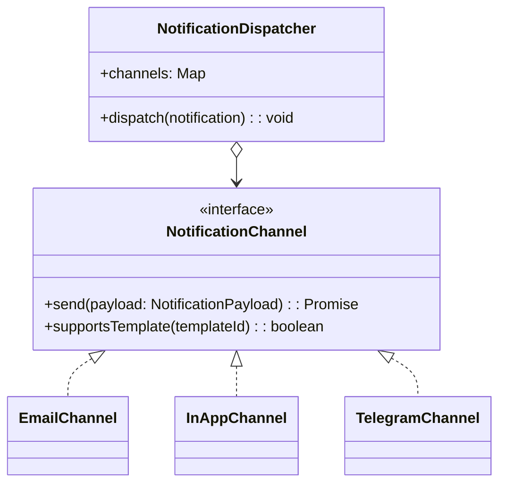
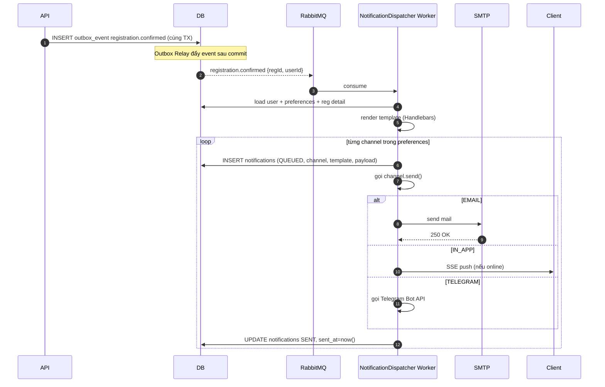

# Đặc tả: Notification

## Mô tả

Tính năng gửi thông báo cho người dùng qua nhiều kênh. Yêu cầu thiết kế **mở rộng**: thêm kênh mới (Telegram, Zalo, Push) **không cần sửa code các module nghiệp vụ**.

Phiên bản 1.0 hỗ trợ:

- **Email** (qua SMTP — dùng MailHog trong môi trường dev).
- **In-App** (lưu DB + đẩy SSE cho client đang online).

Sẵn sàng cắm thêm:

- **Telegram** — chỉ cần thêm 1 class `TelegramChannel` implement interface chung và đăng ký vào factory.

### Kiến trúc — Strategy / Adapter Pattern

> Rendered PNG with white background. Local fallback: `../assets/diagrams-png/specs-notification-01-kien-truc-strategy-adapter-pattern.png`. Mermaid source below is kept for editing.

**Quy ước**:

- Mỗi user có `notification_preferences` (JSON): `{registration_confirmed: ['email','in_app'], payment_failed: ['email']}`.
- `NotificationDispatcher` đọc preference → loop từng channel → gọi `channel.send()`.
- Mỗi channel tự xử lý retry / format / lỗi của mình.

## Luồng chính

> Rendered PNG with white background. Local fallback: `../assets/diagrams-png/specs-notification-02-luong-chinh.png`. Mermaid source below is kept for editing.

### Templates hỗ trợ (phiên bản 1.0)

| Template ID              | Trigger                          | Channels mặc định     |
| ------------------------ | -------------------------------- | --------------------- |
| `registration_confirmed` | event `registration.confirmed`   | email + in_app        |
| `payment_succeeded`      | event `payment.succeeded`        | email + in_app        |
| `payment_failed`         | event `payment.failed`           | email                 |
| `hold_expiring_soon`     | cron (5 phút trước hết hạn hold) | in_app                |
| `hold_expired`           | event `registration.expired`     | in_app                |
| `workshop_updated`       | event `workshop.updated`         | email + in_app        |
| `workshop_cancelled`     | event `workshop.cancelled`       | email + in_app        |
| `checkin_confirmed`      | event `checkin.confirmed`        | in_app                |
| `csv_import_failed`      | event `csv.import_failed`        | email (chỉ SYS_ADMIN) |

### In-App Notification

- Lưu vào bảng `notifications` với channel=`IN_APP`.
- Client subscribe SSE `/notifications/stream` (kèm JWT).
- Endpoint `GET /notifications/me?unread=true&limit=20`.
- Endpoint `POST /notifications/{id}/read` để đánh dấu đã đọc.

### Cách thêm Telegram Channel sau này

1. Tạo class `TelegramChannel implements NotificationChannel`.
2. Đăng ký trong `NotificationModule` providers.
3. Cập nhật enum `notification_channel` trong DB (đã có sẵn).
4. Cho phép user thêm `telegram_chat_id` vào profile.
5. Thêm `'telegram'` vào preferences default.
6. **Không cần thay đổi** code các module sinh event (auth, registration, payment, ...).

## Kịch bản lỗi

| Tình huống                                      | Phản ứng                                                                                                                                           |
| ----------------------------------------------- | -------------------------------------------------------------------------------------------------------------------------------------------------- |
| SMTP timeout                                    | Retry 3 lần với exponential backoff (10s, 30s, 90s); sau đó mark `FAILED`, log                                                                     |
| User chưa có email (có MSSV nhưng email NULL)   | Skip email channel, vẫn gửi in-app                                                                                                                 |
| Telegram chat_id sai                            | Mark `FAILED`, không retry; có endpoint admin xem failed list                                                                                      |
| Worker chết giữa chừng dispatching              | Event vẫn ở RabbitMQ (manual ack); worker mới retry; idempotency: kiểm tra `notifications` đã tồn tại với `(user_id, template, channel, event_id)` |
| Event MQ bị duplicate (do producer retry)       | Dispatcher idempotent: check trước khi tạo notification                                                                                            |
| Client offline khi gửi in-app SSE               | Không sao — client lúc online sẽ `GET /notifications/me` thấy đầy đủ                                                                               |
| Spam (gửi cùng template nhiều lần trong 1 phút) | Throttle: cùng `(user, template)` không gửi quá 1 lần / 60 giây                                                                                    |
| RabbitMQ down                                   | Outbox lưu sẵn ở DB; Outbox Relay tự retry khi MQ phục hồi                                                                                         |

## Ràng buộc

- **Mở rộng**: Thêm channel mới chỉ cần thêm 1 file class + đăng ký, không sửa logic nghiệp vụ.
- **Tính nhất quán**:
  - Mỗi event → có audit trail trong `notifications`.
  - Idempotency dựa trên UNIQUE `(user_id, template, channel, event_id)`.
- **Hiệu năng**:
  - In-app SSE p95 < 2s từ event → client.
  - Email p95 < 30s.
- **Bảo mật**:
  - Email body không chứa token nhạy cảm (chỉ link đến app).
  - SSE channel có JWT.
- **Quan sát**:
  - Metrics: `notifications_sent_total{channel,status}`, `notifications_failed_total{channel,reason}`.

## Tiêu chí chấp nhận

- [ ] AC-01: SV đăng ký thành công → nhận email + in-app trong < 30s.
- [ ] AC-02: ORGANIZER huỷ workshop → mọi SV đã đăng ký nhận thông báo trong < 5 phút.
- [ ] AC-03: SMTP down → notification status `QUEUED → FAILED` sau 3 retry; log rõ ràng.
- [ ] AC-04: SMTP phục hồi → retry job chạy lại notification `FAILED` có `attempts < 5`.
- [ ] AC-05: Thêm 1 class `MockTelegramChannel` (tự viết khi demo) → chạy được mà không sửa Registration/Payment module → demo thêm channel mới.
- [ ] AC-06: SSE đẩy in-app notification trong < 2s khi user đang online.
- [ ] AC-07: Worker chết → restart → notifications đã pending vẫn được gửi (không mất, không trùng).
- [ ] AC-08: Spam control: 2 lần `registration.confirmed` cho cùng user/reg trong 60s → chỉ gửi 1 email.
- [ ] AC-09: User mark notification đã đọc → `GET /notifications/me?unread=true` không còn trả notification đó.
