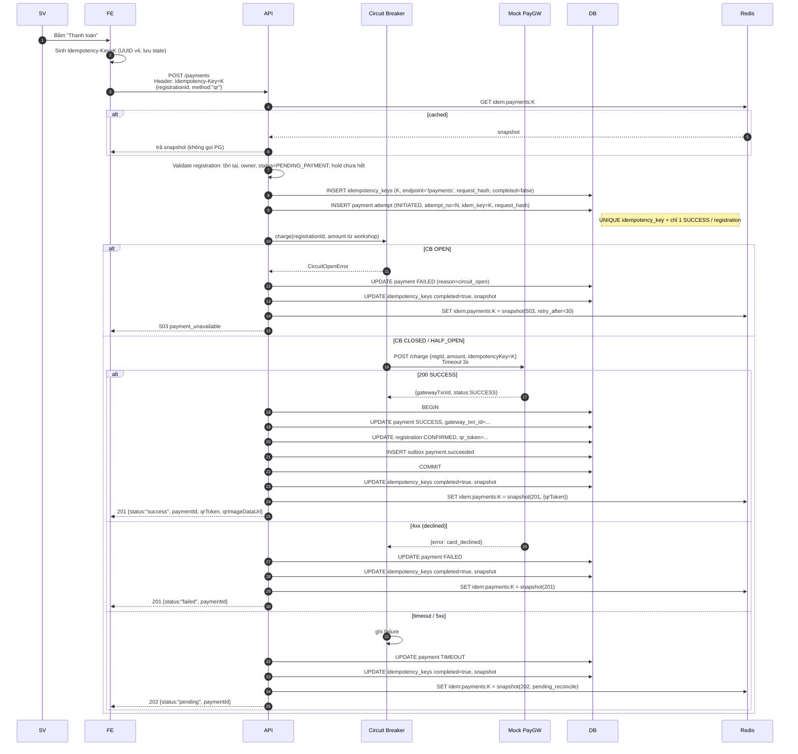

# Đặc tả: Thanh toán (Payment)

## Mô tả

Tính năng xử lý thanh toán cho workshop có phí, qua **Mock Payment Gateway**. Phải:

- Đảm bảo **không trừ tiền 2 lần** dù client retry (Idempotency Key).
- Đảm bảo **hệ thống không sập khi gateway down** (Circuit Breaker + Graceful Degradation).
- Đồng bộ trạng thái với gateway qua **webhook** + **reconcile job**.

## Luồng chính

### A. Khởi tạo thanh toán

> Rendered PNG with white background. Local fallback: `../assets/diagrams-png/specs-payment-01-a-khoi-tao-thanh-toan.png`. Mermaid source below is kept for editing.

### B. Webhook từ Gateway

1. PG gọi `POST /payments/webhook` với HMAC signature header `X-Mock-Pg-Signature`.
2. Backend verify HMAC bằng shared secret (env).
3. Tra `payment` theo `gateway_txn_id` hoặc `idempotency_key` trong payload gateway.
4. Cập nhật trạng thái idempotent: nếu đã `SUCCESS` → bỏ qua; nếu `TIMEOUT`/`PENDING`/`INITIATED` → `SUCCESS` + confirm registration.
5. Trả 200 ngay (gateway có thể retry nếu không nhận 200).

### C. Reconcile Job (mỗi 5 phút)

1. `SELECT * FROM payments WHERE status IN ('TIMEOUT','PENDING','INITIATED') AND created_at < now() - interval '2 min'`.
2. Với mỗi payment, nếu có `gateway_txn_id` thì gọi `GET /charge/{gatewayTxnId}` qua Circuit Breaker; nếu chưa có `gateway_txn_id` thì tra theo `idempotency_key` hoặc mark `FAILED` nếu gateway xác nhận chưa từng nhận charge.
3. Cập nhật trạng thái theo response.
4. Nếu gateway không tìm thấy txn (chưa từng tạo) → `FAILED`.
5. Sau khi `FAILED`, sinh viên được bấm thanh toán lại bằng **Idempotency-Key mới**, tạo `payment attempt` mới cho cùng registration.

### D. Refund (huỷ workshop hoặc SV cancel)

1. Workshop cancel hoặc registration cancel gọi `PaymentRefundService.refundPayment(...)` trong backend, không mở public API riêng.
2. INSERT `payment_refunds` row status `REQUESTED`.
3. Gọi PG `POST /refund` qua Circuit Breaker; nếu CB Open → giữ row `REQUESTED` và retry bằng job nội bộ khi Closed.
4. Khi refund thành công → mark refund `SUCCESS`, payment `REFUNDED`.

## Kịch bản lỗi

| Tình huống                                                  | Phản ứng                                                                                                            |
| ----------------------------------------------------------- | ------------------------------------------------------------------------------------------------------------------- |
| Client retry POST /payments với cùng K, payload giống       | Trả snapshot cũ, **không gọi PG lần 2**                                                                             |
| Client gửi cùng K nhưng payload khác                        | 422 `idempotency_key_reused`                                                                                        |
| 2 request đồng thời cùng K                                  | DB UNIQUE chặn 1; request thua đợi 100ms rồi đọc snapshot                                                           |
| Gateway timeout                                             | Status `TIMEOUT`; trả 202 `{status:"pending"}`; webhook/reconcile sẽ chốt, không gọi charge lại với cùng key        |
| Gateway down kéo dài                                        | Circuit Open → fail-fast 503 → catalog/đăng ký free vẫn chạy                                                        |
| Webhook đến trước khi /payments trả response                | Hợp lệ — webhook update đầu tiên, response của /payments idempotent đọc lại trạng thái                              |
| Webhook bị tampering (sai HMAC)                             | 401 + log security event                                                                                            |
| Webhook đến sau khi reg đã EXPIRED                          | Mark payment `SUCCESS` nhưng reg `EXPIRED` → tự động refund + thông báo                                             |
| User huỷ workshop sau khi đã thanh toán                     | Refund qua Circuit Breaker; nếu CB Open → enqueue refund queue, retry sau                                           |
| `idempotency_keys` conflict do replay sau khi Redis bay TTL | Đọc snapshot từ DB; nếu là payment cũ thì `payments.idempotency_key` vẫn chặn duplicate charge                      |
| Payment attempt trước `FAILED`, user thanh toán lại         | Tạo attempt mới với `attempt_no=N+1`, Idempotency-Key mới; partial unique index chỉ cho 1 `SUCCESS`                 |
| Server restart giữa lúc gọi PG nhưng PG đã trừ tiền         | Webhook từ PG sẽ về và update `SUCCESS`; reconcile job cũng phát hiện                                               |

## Ràng buộc

- **Bảo mật tài chính**:
  - Idempotency-Key bắt buộc (header), reject 400 nếu thiếu.
  - HMAC verify webhook.
  - HTTPS only.
  - Không log số thẻ / OTP / mã giao dịch nhạy cảm.
- **Tính nhất quán**:
  - Idempotency snapshot lưu **đồng thời Redis (TTL 24h) + PostgreSQL `idempotency_keys`**.
  - `payments.idempotency_key` UNIQUE chống duplicate charge dài hạn.
  - Cho phép nhiều attempt theo `(registration_id, attempt_no)`, nhưng chỉ một payment `SUCCESS` cho mỗi registration.
  - Webhook idempotent (xử lý lần 2 không tạo bản ghi mới).
- **Hiệu năng**:
  - `POST /payments` p95 < 1.5s khi PG khoẻ.
  - Khi Circuit Open, response < 50ms (fail-fast).
- **Khả dụng**:
  - PG down ≤ 24h → không ảnh hưởng catalog/đăng ký free/check-in/AI.
  - Reconcile job đảm bảo mọi payment `TIMEOUT` được giải quyết trong ≤ 10 phút.

## Tiêu chí chấp nhận

- [ ] AC-01: Thanh toán thành công → API trả 201, registration `CONFIRMED` + `qrToken` cấp.
- [ ] AC-02: Gửi 5 lần POST `/payments` với cùng Idempotency-Key + cùng payload → đúng **1 charge** ở Mock PG (kiểm tra log PG); mọi response giống nhau.
- [ ] AC-03: Cùng Idempotency-Key + payload khác → 422.
- [ ] AC-04: Bật `MOCK_PG_DOWN=true` ≥ 30s → Circuit Open, request mới trả 503 trong < 50ms; catalog vẫn chạy bình thường.
- [ ] AC-05: Bật `MOCK_PG_DOWN=true` rồi tắt → Circuit Half-Open thử 1 request → đóng lại sau 3 success.
- [ ] AC-06: Gateway timeout → API trả 202 `{status:"pending"}`; webhook đến sau → registration cuối cùng `CONFIRMED`.
- [ ] AC-07: Webhook sai HMAC → 401, không update gì.
- [ ] AC-08: Workshop bị huỷ sau thanh toán → refund được kích hoạt; mark `REFUNDED` sau khi refund job/service thành công.
- [ ] AC-09: Reconcile job phát hiện payment `TIMEOUT` mà PG đã `SUCCESS` → tự đồng bộ trong ≤ 10 phút.
- [ ] AC-10: Endpoint `GET /system/health/payment` trả đúng trạng thái Circuit (`closed|open|half_open`).
- [ ] AC-11: Payment attempt đầu `FAILED` → user thanh toán lại bằng key mới → tạo attempt mới, nhưng nếu một attempt đã `SUCCESS` thì attempt sau bị reject.
