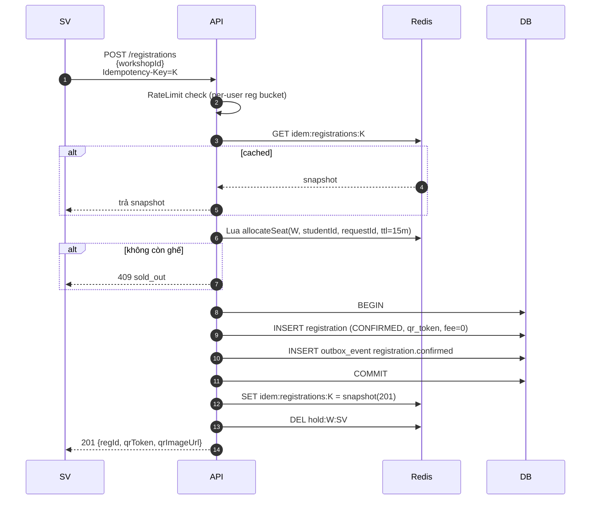
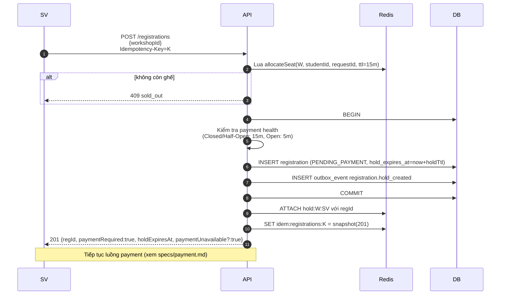

# Đặc tả: Đăng ký Workshop

## Mô tả

Tính năng cho phép sinh viên đăng ký tham gia workshop. Gồm 2 nhánh:

- **Workshop miễn phí**: đăng ký → CONFIRMED ngay → cấp QR.
- **Workshop có phí**: đăng ký → giữ ghế (`PENDING_PAYMENT`, hold 15 phút) → thanh toán → CONFIRMED → cấp QR.

Đặc biệt phải đảm bảo:

- Không trùng ghế (race condition khi 1000 SV cùng đăng ký 1 ghế cuối).
- Không cho 1 SV đăng ký cùng 1 workshop nhiều lần.
- Tính công bằng (FCFS) khi tải đột biến.

## Luồng chính

### A. Đăng ký workshop miễn phí


> Rendered PNG with white background. Local fallback: `../assets/diagrams-png/specs-registration-01-a-ang-ky-workshop-mien-phi.png`. Mermaid source below is kept for editing.



### B. Đăng ký workshop có phí (giai đoạn giữ ghế)


> Rendered PNG with white background. Local fallback: `../assets/diagrams-png/specs-registration-02-b-ang-ky-workshop-co-phi-giai-oan-giu-ghe.png`. Mermaid source below is kept for editing.



### C. Job dọn ghế hết hạn (mỗi phút)

1. `SELECT id, workshop_id FROM registrations WHERE status='PENDING_PAYMENT' AND hold_expires_at < now()`.
2. Với mỗi item:
   - `UPDATE registrations SET status='EXPIRED', cancelled_at=now()`.
   - Gọi Lua `releaseSeat(workshopId, studentId, regId)` để `INCR seat:{workshopId}` an toàn đúng 1 lần.
   - `DEL hold:{workshopId}:{studentId}`.
   - Gửi notification "Ghế của bạn đã hết hạn giữ".
3. Sweeper cũng quét các `hold:*` không có `regId` hoặc không có registration tương ứng (backend chết sau khi giữ ghế Redis) và release trong ≤ 60 giây.

### D. SV chủ động huỷ đăng ký

1. `DELETE /registrations/{id}` (chỉ owner).
2. Nếu `CONFIRMED` và workshop chưa diễn ra (`now < start_at - 1h`):
   - `UPDATE status='CANCELLED'`.
   - Gọi Lua `releaseSeat(workshopId, studentId, regId)`.
   - Nếu đã thanh toán → trigger refund.
3. Nếu `start_at - now < 1h` → 422 `cancellation_window_closed`.

### E. Sinh QR Token

QR token là JWT ký RS256:

```json
{
  "regId": "<uuid>",
  "workshopId": "<uuid>",
  "studentId": "<uuid>",
  "validFrom": "<start_at - 1h>",
  "validTo": "<end_at + 1h>",
  "exp": "<end_at + 1h>",
  "jti": "<uuid>"
}
```

QR image render từ token bằng `qrcode` lib, lưu MinIO (presigned URL TTL 24h).

## Kịch bản lỗi

| Tình huống                                            | Phản ứng                                                                                                                           |
| ----------------------------------------------------- | ---------------------------------------------------------------------------------------------------------------------------------- |
| 1000 SV cùng `allocateSeat` khi còn 1 chỗ             | Đúng 1 SV thắng; 999 SV nhận 409 `sold_out`; không cần rollback âm vì Lua không cho giảm dưới 0                                    |
| SV đã đăng ký cùng workshop trước đó                  | DB UNIQUE `(workshop_id, student_id)` → 409 `already_registered`; trả `regId` đã có                                                |
| Idempotency-Key gửi 2 lần với cùng payload            | Trả snapshot, không tạo registration mới                                                                                           |
| Idempotency-Key gửi với payload khác                  | 422 `idempotency_key_reused`                                                                                                       |
| Workshop đã `ENDED` hoặc `CANCELLED`                  | 410 `workshop_not_open`                                                                                                            |
| MSSV của SV không còn `is_active`                     | 403 `student_inactive` (re-check tại request, không chỉ tại login)                                                                 |
| Backend chết sau khi giữ ghế Redis nhưng trước INSERT | Hold Redis có `requestId` nhưng không có `regId`; sweeper release ghế trong ≤ 60 giây                                              |
| 2 tab cùng đăng ký 1 workshop                         | Idempotency-Key khác nhau → tab thứ 2 sẽ 409 `already_registered`                                                                  |
| Rate limit per-user reg đạt ngưỡng                    | 429 `too_many_attempts`, Retry-After                                                                                               |
| Global registration limit đạt ngưỡng                  | 202 `QUEUED`, client polling `GET /registrations/processing/{processingId}`                                                        |
| Queue đầy hoặc item hết TTL                           | 503 `registration_queue_full`, không tạo registration ngầm                                                                         |
| Payment Circuit Open khi đăng ký workshop có phí      | Vẫn tạo `PENDING_PAYMENT`, nhưng hold rút xuống 5 phút và response kèm `paymentUnavailable=true` để UI hiển thị banner             |
| Hold hết hạn nhưng SV vừa thanh toán xong             | Race: payment SUCCESS sẽ check `registration.status` và `hold_expires_at`; nếu đã EXPIRED → mark payment refundable + thông báo SV |

## Ràng buộc

- **Tính nhất quán**:
  - `seat:{id}` Redis ↔ DB phải đồng bộ. Job reconcile mỗi phút.
  - Redis hold phải được tạo cùng lúc với seat decrement bằng Lua; DB insert fail thì domain service gọi `releaseSeat`, sweeper xử lý phần crash.
  - Hold expires tự dọn trong < 60 giây sau hết hạn.
- **Hiệu năng**:
  - `POST /registrations` p95 < 800 ms ngay cả khi 500 RPS.
  - Job dọn ghế xử lý 10K rows/chạy trong < 5s.
- **Bảo mật**:
  - QR token có TTL ngắn (đến `end_at + 1h`); revoke được qua Redis blacklist.
  - Mobile verify chữ ký RS256 offline → không cho QR giả.
- **UX**:
  - Khi 429, hiển thị countdown theo `Retry-After` và tự backoff, không spam click.
  - Khi 202 `QUEUED`, hiển thị "Hệ thống đang quá tải, đang xử lý theo thứ tự cho bạn..." và polling kết quả.
  - Khi 409 sold_out, gợi ý workshop tương tự khác.

## Tiêu chí chấp nhận

- [ ] AC-01: 1000 client đồng thời đăng ký workshop có 1 chỗ → đúng 1 client nhận 201 CONFIRMED.
- [ ] AC-02: SV đăng ký 2 lần cùng workshop → lần 2 nhận 409 `already_registered` với `regId` cũ.
- [ ] AC-03: SV đăng ký workshop free → nhận 201 + qrToken hợp lệ.
- [ ] AC-04: SV đăng ký workshop có phí mà không thanh toán trong 15 phút (hoặc 5 phút khi payment circuit open) → ghế trả lại, nhận thông báo.
- [ ] AC-05: SV cancel registration trước workshop ≥ 1 giờ → ghế được trả lại + (nếu đã trả) refund.
- [ ] AC-06: SV cancel khi workshop bắt đầu trong < 1 giờ → 422.
- [ ] AC-07: QR token bị sửa payload → server và mobile đều reject (signature invalid).
- [ ] AC-08: Reset Redis (`FLUSHALL`) → job reconcile khôi phục đúng `seat:{id}` từ DB trong < 60s.
- [ ] AC-09: Idempotency replay POST `/registrations` → 1 registration được tạo, lần 2 trả response cũ.
- [ ] AC-10: Workshop bị ORGANIZER huỷ → mọi registration tự CANCELLED + thông báo trong < 5 phút.
- [ ] AC-11: Khi global limit vượt 500 req/s, request hợp lệ nhận 202 `QUEUED` và kết quả cuối cùng được xử lý FIFO.
